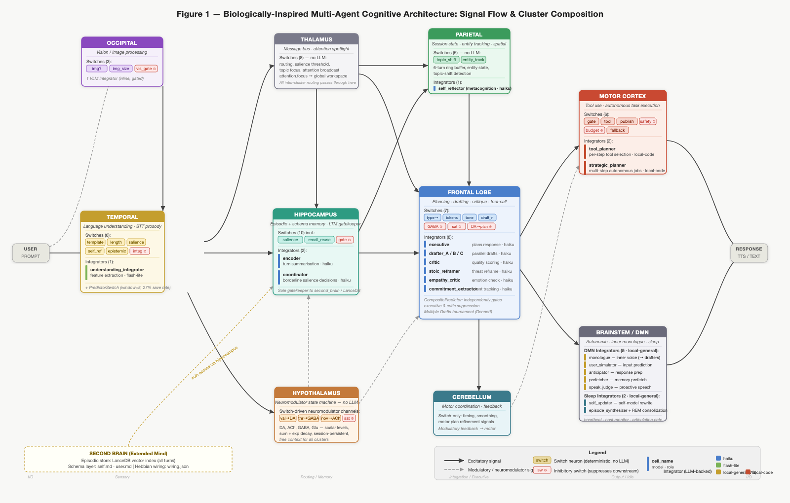

# A Biologically-Inspired Multi-Agent Cognitive Architecture: Design, Implementation, and Early Observations

**Russ O'Reagan**  
*Unpublished technical report, May 2026*

---

## Abstract

We describe the design, implementation, and early empirical observations of a biologically-inspired cognitive architecture whose central hypothesis is that implementing the affective substrate of cognition — persistent emotional state that modulates computation rather than merely framing output — produces a system that develops differently over time. The architecture maps explicitly onto regions of the human brain, with a two-tier chemical signaling system — five fast neuromodulators (dopamine, acetylcholine, GABA, glutamate, norepinephrine) and four slow hormones (serotonin, cortisol, oxytocin, anandamide) — coordinating a fixed set of heterogeneous, region-specific agents rather than a central planner. Language model calls are treated as expensive convergence-zone events, with the majority of per-turn computation delegated to cheap, deterministic switch neurons. The architecture draws from predictive processing theory (Friston, Clark), dual-process theory (Kahneman), Global Workspace Theory (Baars, Dehaene), Dennett's Multiple Drafts model, and Clark and Chalmers' extended mind hypothesis. The current dataset covers 350 turns across 60 sessions. The system operates within its designed cost envelope (mean 3.23 LLM calls/turn against a target of 3–5), demonstrates functional neuromodulator dynamics, and produces measurable predict-and-surprise gating saves (26.0% of turns). Memory recall is active on 33.1% of turns. Two Hebbian sleep consolidation passes provide first evidence of edge weight reinforcement. Fourteen distinct emotional states have been observed; `scattered` is the third most common at 9% and correlates with a recognizable DA-floor neuromodulator signature. ACh declines across the dataset from early to late sessions — a longitudinal signal whose most plausible interpretation is that 60 sessions of history has made the system's conversational environment progressively more familiar. The system also incorporates deliberate emotional expression (audio/visual-only performance, decoupled from neuromodulator state), DMN autonomy with urgency-ranked deferred thoughts, a background resource policy governing autonomous computation, and a self-directed multi-step task system. Several mechanisms remain too nascent to evaluate, and the central question of whether multi-agent structure improves on a single well-prompted model has not yet been subjected to controlled comparison. We present the architecture, its philosophical commitments, and an honest account of what the data does and does not indicate.

---

## 1. Introduction

The dominant paradigm in contemporary multi-agent LLM systems is orchestration: a planner decomposes tasks, dispatches specialized agents, and synthesizes their outputs. This is efficient for clearly-structured workflows but is architecturally at odds with what we know about biological cognition. Real brains have no central orchestrator. Intelligence in biological systems emerges from the interaction of modular, largely autonomous processing regions, bound by shared chemical signaling, mediated by prediction error, and shaped by experience-dependent plasticity.

This project is a prototype of an alternative paradigm: **a brain-region-mapped cognitive architecture in which computation is coordinated by neuromodulator dynamics rather than a central planner, and LLM calls are reserved for genuine convergence-zone reasoning**. The system, called the "super intelligence app" in working materials, is not an attempt to build artificial general intelligence. It is an attempt to ask a more specific question: can you implement the affective substrate of cognition faithfully enough that emotional state does real computational work — gating processing, shaping memory retrieval, modulating what gets learned — and if so, does the result develop differently over time?

The motivation is experimental rather than immediately practical. In biological brains, affect is not decoration. Neuromodulatory systems — dopamine, acetylcholine, GABA, and their relatives — regulate attention, arousal, inhibitory tone, and synaptic plasticity at the architectural level. They determine what gets attended to, how confidently conclusions are held, and how readily behavior adapts. Existing LLM systems treat emotional register as a prompt property: you can instruct a model to respond warmly or cautiously, but this is style, not state. The hypothesis here is that an architecture with genuine affective dynamics — state that persists across turns, that modulates computation rather than merely framing output — will produce meaningfully different behavior over a long enough window. Whether that difference translates to better performance on technical tasks is a secondary question, and probably not the first place evidence will appear. The more immediate prediction is behavioral continuity: a system that develops something like a stable character through the interaction of experience, emotional state, and plasticity. The cost efficiency that follows from sparse, prediction-gated LLM activation is a consequence of this design, not its goal.

This paper documents the design rationale, the philosophical commitments, the implementation as built, and the early empirical observations. The system is operational but young. Many mechanisms have been implemented but not yet accumulated enough history to produce evaluable evidence. Where we have signal, we report it. Where we do not, we say so explicitly.

---

## 2. Background and Prior Art

### 2.1 Computational precursors

The idea of intelligence from interacting simple agents has a 40-year history. **Minsky's Society of Mind** (1986) proposed the direct ancestor: intelligence as a "society" of simple, mindless agents organized into "agencies." The proposal was influential but never produced a working implementation — the interaction mechanism between agents was described without the mathematics needed to make it work.

**Blackboard architectures** (HEARSAY-II, BB1, 1970s–90s) were the canonical implementation: multiple knowledge sources reading and writing to a shared workspace. They succeeded on narrow problems (speech recognition, medical diagnosis) but failed to scale. The coordination overhead of many agents sharing a blackboard eventually exceeded the value of their specialization.

**SOAR, ACT-R**, and related cognitive architectures produced research insights but hit ceilings imposed by hand-engineered module boundaries. **Numenta's Hierarchical Temporal Memory** produced useful anomaly detection but never generalized to language or broad reasoning.

**Generative Agents** (Park et al., Stanford, 2023, 2025) are the closest LLM-era prior art. Their simulated communities of LLM-powered agents exhibited believable emergent social behaviors and predicted real survey responses at 85% normalized accuracy. A significant caveat from the same research: behavioral-economic game performance matched simpler demographic baselines at 66%, suggesting that much of the "emergence" came from prompt design rather than from multi-agent interaction. This critique is a consistent thread in the recent literature: when given equal compute, a single well-prompted LLM often matches or exceeds multi-agent systems on raw task quality.

The conclusion we draw from this history is not that multi-agent architectures are unpromising, but that their value proposition requires precision. Multi-agent design earns its cost through **legibility** (observable internal processing), **persistent specialized state** (neuromodulators, Hebbian weights), and **structural constraints that force behaviors the prompt alone cannot reliably produce** (inhibitory circuits, prediction gating, arousal modulation). If the architecture merely adds coordination overhead to what a well-prompted single model would do anyway, it has failed.

### 2.2 Recent breakthroughs informing the design

**Active Inference and the Free Energy Principle** (Friston; VERSES AI, 2025) provides the most biologically faithful active research direction for multi-agent systems. Agents minimize prediction error by updating beliefs or acting on the world. Hierarchical multi-agent Active Inference frameworks have been demonstrated in robotics, coordinating multiple predictive agents without central planning. The predict-and-surprise gating mechanism in this system is a direct instantiation of Active Inference at the cluster level.

**Predictive Processing** (Clark, *Surfing Uncertainty*; Friston) frames cortical computation as fundamentally predictive: top-down predictions flow downward, bottom-up prediction errors flow upward, and computation is the process of "explaining away surprise." This maps cleanly onto a design where most cells fire only when their input disagrees with expectation.

**Spiking Neural Networks + LLM hybrids** (SpikeLLM, NSLLM, 2024–2026) achieve event-driven computation — fire only on meaningful signal — at the intra-model level. NSLLM reports 19× energy efficiency improvements. The architectural principle (spend compute proportional to signal novelty) is the same as this system's, applied at the cluster level rather than the token level.

### 2.3 Novelty of this design

The closest pattern in the broader literature is **neuro-symbolic AI** — LLMs wrapped between deterministic control layers (SYNAPSE, AUTOBUS, Pre3, Formal-LLM). These apply the gating principle for task orchestration with auditability in compliance and industrial contexts. No existing published system applies this pattern as a **literal brain-region-mapped architecture with neuromodulator dynamics, Hebbian plasticity, hippocampus-gated long-term memory, and predictive processing gating as the primary mechanism of a general-purpose conversational entity** — and none frames the central research question as whether genuine affective architecture produces meaningfully different longitudinal behavior. That is the specific contribution this prototype makes.

---

## 3. Philosophical Foundations

The architecture is not merely borrowed from biology. Each major design decision maps to an established position in philosophy of mind. Making these commitments explicit does two things: it sharpens each design choice and makes honest what the system is and is not claimed to be.

### 3.1 Commitments

**Functionalism (Putnam, Fodor).** The functionalist claim is that what makes something a mental state is not what it's made of, but what it *does* — the causal role it plays in a system. A belief is a belief because of how it interacts with perception, reasoning, and action, not because it happens to live in biological neurons. This means the same mental state can, in principle, be implemented in silicon, language models, or anything else that plays the same functional role. The entire design rests on this commitment: cluster specifications define inputs, outputs, and state; the substrate that runs them — local Ollama, cloud API, or anything else — is architecturally irrelevant. The system has been run with three different model backends with no structural change in behavior.

**Dual-Process Theory (Kahneman).** Cognitive science has long distinguished two modes of thought: fast, automatic, parallel processing that operates below conscious attention, and slow, effortful, deliberate reasoning. Most of cognition is the first kind; the second kind is expensive and gets invoked only when the first signals that something requires more careful handling. In this system, switch neurons are System 1: deterministic, parallel, cheap, operating constantly. Integrator LLMs are System 2: slow, expensive, invoked only at convergence zones. Predict-and-surprise gating is the explicit mechanism for deciding which mode to engage — stay in System 1 unless something doesn't add up.

**Global Workspace Theory (Baars, Dehaene).** The theory proposes that the brain's many parallel processing regions mostly operate independently and "unconsciously." A small fraction of neural activity is broadcast to a global workspace — a kind of bulletin board accessible to the whole brain — and only that broadcast activity is available for explicit reasoning or verbal report. The message bus with its `attention.focus` topic implements this directly. Most inter-cluster traffic is local and never integrated; high-salience messages are promoted to `attention.focus` and become available system-wide.

**Multiple Drafts Model (Dennett, *Consciousness Explained*, 1991).** Dennett's challenge to the intuitive picture of consciousness: there is no central observer watching a unified stream. The brain runs many parallel narrative drafts simultaneously, with no single privileged version. What becomes "conscious" is whichever draft survives when it is probed — there is no fact of the matter about what you "really" thought before you were asked. The frontal drafter tournament instantiates this directly. There is no true response the system intended — there are competing drafts, and the articulation gate emits whichever survived when the timeout fired. This is the Multiple Drafts model running in code.

**Extended Mind Hypothesis (Clark & Chalmers, 1998).** The standard assumption is that the mind stops at the skull. Clark and Chalmers argued that if an external resource plays the same functional role as an internal cognitive process — reliably available, automatically endorsed, directly acted upon — then it is constitutive of the mind, not merely a tool for it. The second brain satisfies these conditions: it is always accessible, its content directly shapes responses, and the system endorses it as its own memory rather than querying it skeptically. One notable extension beyond the original argument: Clark and Chalmers' canonical example assumes an imperfect external store compensating for biological forgetting. This system's second brain is non-degrading. Identity here emerges not from selective forgetting but from Hebbian weight history, neuromodulator baselines, and accumulated self-narrative.

**Predictive Processing (Clark, Friston).** The dominant contemporary theory of cortical function: rather than passively receiving input and computing a response, the brain is constantly generating predictions and updating them when they fail. Processing is proportional to prediction error — familiar inputs are handled cheaply; surprising ones demand more. Each cluster contains a predictor switch implementing this directly. Routine turns in familiar conversations spend almost nothing; novel turns invoke integrators. The design operationalizes the "controlled hallucination" view of perception: the system's default behavior is to emit a predicted response, with actual LLM computation triggered only when prediction fails.

**Narrative Self (Dennett, Hume, Locke).** Hume argued personal identity is not a thing but a story — a bundle of experiences held together by memory and narrative continuity. Locke located personal identity precisely in memory: what makes you the same person you were yesterday is that you remember being that person. The entity maintains a self-schema file updated at sleep consolidation. With a perfect, non-degrading episodic store and an explicit self-narrative, this system has stronger identity continuity than any biological one — whose memory degrades, distorts, and selectively forgets.

### 3.2 Honest disclaimers

**Chinese Room (Searle, 1980).** The integrators manipulate symbols. No claim of genuine understanding is made. The system can appear competent without comprehending.

**Hard Problem of Consciousness (Chalmers, 1995).** No claim of phenomenal consciousness or qualia. The neuromodulator levels are called "DA" and "ACh" because they play functionally analogous roles, not because there is any claim of subjective experience of reward or attention.

**Frame Problem (McCarthy & Hayes, 1969).** The attention and salience mechanisms are heuristic. Knowing what is *relevant* in a given moment remains genuinely hard, and no principled solution is claimed here.

The system is explicitly described, in its own CONSTITUTION.md, as building "functional analogs of mental processes. That is enough to be interesting. It is not enough to be a mind."

---

## 4. Architecture

### 4.1 Core computational model: switches and integrators

Two distinct node types mirror how real neural tissue works.

**Switch neurons** are pure Python objects: no LLM, no token cost, deterministic, and capable of running massively parallel. They perform gating (decide whether to spend an LLM call at all), routing (select which processing path a turn takes), state-holding (persistent neuromodulator levels with exponential decay), modulation (sum, decay, and threshold over time), inhibition (subtract from downstream activation), and memory I/O primitives (vector similarity search, Markdown pattern matching). Approximately 20% of every cluster's switches are explicitly inhibitory, mirroring the roughly 80:20 excitatory-to-inhibitory ratio in biological cortex. This is structural cascade prevention: runaway excitation is suppressed by abundant inhibitory wiring rather than by a global budget cap.

**Integrator cells** are LLM-backed and fire only at convergence zones where genuine context integration is required. They exist at: temporal language understanding (intent, entities, register, memory requirements), vision processing (VLM for image inputs), hippocampus encoding (turn summarization for long-term memory), hippocampus coordination (borderline salience decisions), and the frontal lobe (executive coordination, multiple drafters, critics).

The critical constraint: **switches speak in numbers, integrators speak in words**. Text only exists where reasoning is required. Switch-to-switch messages carry activation levels and feature tags. The convergence event that wakes an integrator carries the raw text only at that moment.

### 4.2 Predict-and-surprise gating (Active Inference at cluster level)

Each cluster contains a `PredictorSwitch` that maintains a short history (window size 8) of input-signature to output-tag mappings. When new input arrives:

1. The predictor fires its prediction and confidence estimate.
2. Switches process the input and emit actual outputs.
3. A comparator computes prediction error (a distance metric between prediction and actuals).
4. **Low surprise** → the integrator stays asleep; the predicted output is emitted as if the integrator had reasoned.
5. **High surprise** → the integrator wakes with the failed prediction as additional context.

An **emotion-aware veto** overrides this gating when the entity or user is in a non-routine emotional state. The rationale, stated explicitly in the code, is that a statistically valid prediction may be "morally wrong" — the moment deserves fresh attention, not a cached response. Emotional states triggering the veto include reactive states (angry, defensive, frustrated, sympathetic) and user distress states (distressed, hostile, overwhelmed). Vocal stress detection from the Deepgram prosody pipeline also triggers bypass.

The `CompositePredictor` in the frontal lobe extends this to structured predictions over richer feature vectors: it independently predicts whether the executive integrator and the critic are needed, suppressing each independently when predictions are confident.

### 4.3 Brain region mapping

| Brain Region | Biological Role | Digital Recast | Implementation |
|---|---|---|---|
| **Frontal lobe** | Planning, working memory, movement | Response drafting/critique, Multiple Drafts engine, tool-call selection | 5+ LLM integrators, ~12 switches, CompositePredictor |
| **Temporal lobe** | Language, auditory processing, declarative memory bridging | Language understanding, prosody features from STT | 1 LLM integrator, ~7 switches, PredictorSwitch |
| **Parietal lobe** | Sensory integration, spatial awareness | Session state ring buffer, entity tracking, topic shift detection | ~5 code switches, no LLM |
| **Occipital lobe** | Visual processing | VLM for image/screenshot inputs | 1 VLM integrator, 3 gating switches |
| **Hippocampus** | Memory storage and recall | Episodic + schema memory; sole gatekeeper to the second brain | 2 LLM integrators, ~10 switches, recall reuse |
| **Hypothalamus** | Drives, affect, homeostasis | Chemical signaling: 5 fast neuromodulators (DA, ACh, GABA, Glu, NE) + 4 slow hormones (5HT, CORT, OXT, AEA); PAD dimensional output; ~25-state emotion mapping | ~5 state switches, no LLM |
| **Thalamus** | Gatekeeper between subcortex and cortex | Message bus + attention spotlight, routing hints | ~8 switches, no LLM |
| **Brainstem** | Vital autonomic functions | Heartbeat, cost monitor, turn-budget enforcer, articulation gate | Code only |
| **PNS** | Peripheral I/O | Text/image input, Deepgram STT, ElevenLabs TTS | Code only |



*Figure 1: Full architecture diagram. Each box is a brain-region cluster. Coloured chips are deterministic **switch neurons** (red-bordered ⊘ = inhibitory). Vertical coloured bars prefix **integrator cells** (LLM-backed); the bar colour encodes the backing model (blue = Haiku, green = flash-lite, amber = local-general 7B, rust = local-code). Solid arrows = excitatory signal flow; dashed arrows = modulatory / neuromodulator channels. The **Second Brain** dashed box (bottom left) is accessible only via the hippocampus cluster. The **predict-and-surprise gate** lives inside the temporal cluster (integ ⊘ chip) and the frontal CompositePredictor.*

### 4.4 User emotion detection

The system maintains a live model of the user's emotional state in parallel with its own. This is not a cosmetic feature. Detected user emotion directly gates the empathy critic, shapes drafter tone selection, modulates neuromodulator updates in the hypothalamus, and triggers appraisal-based emotion overrides in the metacognitive layer. Three signal channels feed in simultaneously.

**Text-based detection** operates on two paths. A fast path uses a curated affect lexicon (~50 entries) mapping emotional words to sentiment deltas, hostility signals, and user emotion labels — covering states from `disappointed` and `anxious` through `playful` and `affectionate`. This runs with no LLM call. A slow path uses a language model integrator that extracts fine-grained features: `user_tone_toward_ai` (approximately 9 categories: warm, joking, praising, polite, neutral, dismissive, impatient, insulting, testing) and `user_emotion` (approximately 20 categories spanning happy, curious, engaged, excited, frustrated, disappointed, sad, anxious, distressed, confused, and surprised), along with continuous `hostility` (0–1) and `sentiment` (−1 to +1). The slow path is itself gated by predict-and-surprise: if the predictor is confident about the user's emotional state from prior context, the integrator call is skipped entirely.

**Prosody-based detection** extracts acoustic features from the speech signal: fundamental frequency (F0/pitch), energy, jitter, shimmer, and voiced fraction. These are classified into tone labels — stressed, energetic, whisper, calm, monotone — by comparing each utterance against a **per-speaker prosody baseline**. Rather than classifying against population norms, the system maintains an individual F0 and energy reference for each enrolled speaker, updated across sessions. A speaker with characteristically high energy is classified as stressed only when their acoustic output significantly exceeds their own norm — not simply when it exceeds a generic threshold. This allows accurate emotion detection across speakers with very different baseline vocal styles. Stressed tone elevates GABA, ACh, and NE; energetic tone elevates Glu and DA; whisper elevates ACh.

**Speech dynamics** extracts temporal features from diarized word timestamps: words per minute (classified as rushed, brisk, normal, halting, or measured), long pause count, a burst score reflecting variance in inter-word timing, and a hesitation flag. Rushed speech elevates Glu, ACh, and NE; halting speech elevates ACh; burst patterns elevate GABA.

All three channels feed into the hypothalamus simultaneously. A **text-affect fallback** handles the common case where neuromodulator levels are slow to move out of a neutral basin: when the neuromod-derived emotion label is neutral but the text strongly signals an emotion, the system overrides with an appropriate label immediately, without waiting for chemical levels to shift.

**Metacognitive appraisal** adds a fourth layer above the chemistry-driven labels. Reading the user's detected emotion and tone alongside the relationship's affection score and familiarity tier from the persistent user schema, the metacognition cell applies priority-ordered inference rules that can override the neuromod-derived label with higher-resolution states:

- **Embarrassed**: multiple response drafts have been vetoed — the system recognizes its own coherence or appropriateness failure
- **Apologetic**: the user expresses frustration or correction following a surprising prior response
- **Sympathetic**: the user is struggling, sad, anxious, or distressed
- **Proud**: a high-quality draft coincides with detected user praise
- **Grateful**: the user praises without an obvious prior accomplishment to attribute it to
- **Relieved**: GABA drops sharply from the prior turn — a threat has passed
- **Flirty**: a multi-factor inference requiring simultaneously high affection score (from persistent schema), warm or playful user tone, playful user emotion, and non-task conversational intent

These appraisal states are applied with a cooldown preventing the same override from firing repeatedly, and propagate downstream to drafter prompts and tone selection. None have been triggered in the current dataset — sessions have been non-hostile and non-emotionally-charged — but the infrastructure is confirmed functional.

### 4.5 Chemical signaling: neuromodulators and hormones

The system implements two tiers of chemical signaling — nine channels total — that function as system-wide tuning parameters, not message streams. All channels are scalar levels maintained by sum-plus-exponential-decay, readable synchronously by any cluster and requiring no LLM call. They are the mechanism by which the system's state at turn N shapes its processing at turn N+1.

**Fast neuromodulators** (decay ~0.85 per turn, respond within 1–3 turns):

- **Dopamine (DA)**: reward and positive valence. Elevated by sentiment and prosody; suppressed by hostility. Modulates drafter willingness and Hebbian learning rate. Effective DA is lifted by serotonin and oxytocin and suppressed by cortisol.
- **Acetylcholine (ACh)**: attention and novelty. Elevated by surprise and input salience; attenuated by satiation when inputs are routine. Modulates memory encoding salience.
- **GABA**: inhibitory tone. Elevated by threat and hostile prosody. Suppresses drafter count via inhibitory edges in the frontal cluster. Amplified by cortisol; buffered by oxytocin.
- **Glutamate (Glu)**: arousal and excitation. Elevated by urgency and high salience. Suppressed when anandamide exceeds its homeostatic threshold.
- **Norepinephrine (NE)**: focused alertness. Elevated by surprise, salience, and threat. Follows an inverted-U: optimal NE (0.20–0.55) sharpens attention; excessive NE (>0.75) produces the `scattered` state. Suppressed by anandamide during arousal overflow.

**Slow hormones** (decay 0.93–0.998 per turn, respond over tens to hundreds of turns):

- **Serotonin (5HT)**: affective baseline. Increments slowly on positive exchanges; drains on sustained hostility. Low 5HT triggers a dysphoric emotion overlay and suppresses effective DA. Acts as the session's long-horizon mood floor.
- **Cortisol (CORT)**: cumulative stress. Elevated by repeated social threat (text-level hostility, not prosody). Amplifies GABA sensitivity and suppresses DA. Antagonized by oxytocin.
- **Oxytocin (OXT)**: trust and affiliation. Builds gradually across positive exchanges (~50 turns to a connected state); drains on hostility. Lifts effective DA, buffers GABA, and actively suppresses cortisol accumulation. The primary driver of the `connected` and `warm` emotion states.
- **Anandamide (AEA)**: homeostatic buffer. Releases when combined NE + Glu exceeds an arousal threshold; also accumulates during positive social exchange. Suppresses excessive NE and Glu, lifts effective DA, and shifts stress-state emotions toward `eased`.

**Cross-channel interactions** give the system nonlinear dynamics that neither tier produces alone. OXT buffers CORT (social bonding reduces chronic stress). AEA suppresses NE/Glu overflow (endocannabinoid homeostasis). CORT amplifies GABA (chronic stress increases inhibitory tone). These interactions mirror the known antagonisms in the neuroendocrine literature.

**Dimensional output**: all nine channels map to three continuous affective dimensions — valence (pleasantness), arousal (activation), and dominance (agency) — via weighted linear combination. These dimensions drive the discrete emotion label via a lookup table of ~25 states, with NE and hormonal color overlays applied on top for states like `vigilant`, `connected`, `withdrawn`, and `eased`.

### 4.6 Memory architecture

**Short-term memory** is the live bus state plus a 6-turn ring buffer in the parietal cluster plus current neuromodulator levels.

**Long-term memory** (the "second brain") has three layers:
- **Episodic layer**: LanceDB vector-indexed turn summaries. Every substantive turn is encoded — the system does not gate storage by salience, only retrieval quality.
- **Schema layer**: human-readable Markdown files of stable facts (`self.md`, `user.md`). Hand-editable. Pre-loaded into working memory at session boot.
- **Hebbian wiring**: edge weights between cells and clusters, persisted to `wiring.json` and updated at sleep consolidation.

Only the hippocampus cluster has import access to the second brain store. All other clusters request memory through bus messages (`mem.recall`, `mem.encode`). This architectural constraint enforces the biological model and provides a clean audit point.

### 4.7 Hebbian plasticity

Edges between nodes carry weights. The composite outcome signal is:

```
outcome = 0.5 × ΔDA_turn + 0.3 × critic_score + 0.2 × user_emotion_valence
```

**ΔDA_turn** is the per-turn dopamine delta — how much DA changed from turn start to turn end — rather than absolute DA vs a neutral baseline. This encodes prediction error in the reward signal (the same quantity biological dopaminergic neurons encode) rather than session mood. The neuromod state at turn start is captured in `TurnTrace.prior_neuromod`; the Hebbian pass computes `(DA_end − DA_start) × 4` scaled to [−1, +1].

**critic_score** only contributes (weight 0.3) when the LLM critic actually evaluated the draft (`critic_ran=True`). For single-draft turns — the majority — the critic term is zeroed to avoid a spurious positive bias from a hardcoded fallback score; the DA delta carries the full directional signal for those turns.

**user_emotion_valence** is read from `TurnTrace.user_emotion` (populated by run.py from temporal understanding features) so the 20% weight contributes for turns with detected user emotional state.

A **plasticity modulator** scales the learning rate by session-averaged DA × ACh — engaged, high-DA sessions learn faster; flat or disengaged sessions learn slowly. A gentle homeostatic decay (1% toward resting weight 1.0 per update) prevents lock-in. Edge weights are consulted live for drafter selection, switch evaluation order, and recall fan-out via epsilon-greedy exploration, providing a soft form of reinforcement without explicit RL machinery.

**Competitive drafter reinforcement** runs at sleep consolidation for turns where the critic compared multiple real drafts. The winning drafter's edge to the executive receives an additional bonus proportional to its margin over the other drafters; losing drafters receive a small penalty. This creates genuine competitive selection pressure between drafters over time, separate from the path-level Hebbian update that treats all traversed edges equally.

### 4.8 Additional modules

**Auditory cortex**: handles all acoustic processing beyond simple transcription. Speaker enrollment uses ECAPA-TDNN — a speaker verification neural network — to produce dense speaker embeddings from raw audio segments. A session-level registry matches new embeddings against known speakers at a permissive threshold; a persistent cross-session store uses a stricter threshold for durable identity. When a new speaker appears, the system attempts to extract their name from the conversation and creates a persistent profile: a running-mean embedding (capped at 20 samples for stability), a per-speaker prosody baseline (F0 mean and energy mean), and an affection score updated by sentiment across interactions. This allows the system to recognize returning speakers across sessions, greet them by name, and apply their individual prosody baseline for emotion detection as described in §4.4. Song fingerprinting (Shazam-style spectral matching) runs continuously on ambient audio and publishes recognized song metadata to the shared bus, available to the DMN for context or for spontaneous mention.

**Default Mode Network (DMN)**: an idle thinking loop that fires every 15 seconds between turns, generating internal monologue, consolidating recent episodes, and simulating the user's likely next message. Thoughts are tagged in-session with their neuromod context, emotion label, direction, and a salience flag. Inner monologue is surfaced directly to the response drafters via a speak-flag signal, giving the drafters awareness of the entity's between-turn thinking. The DMN receives a pre-authorized project manifest on every tick, enabling it to initiate work it is permitted to start autonomously versus work it must propose. Thoughts that are deferred rather than spoken are structured with an urgency level (immediate / high / normal / low): immediate and high-urgency thoughts are written to `deferred_thoughts.md` for explicit surfacing on user return; lower-urgency thoughts are encoded as episodic memories tagged `[deferred_question]`, surfaced later via a dedicated parallel recall budget of 2 slots (separate from the conversation-memory pool, so deferred questions never compete with regular memories for top-k retrieval). Idle thinking and autonomous project work run in parallel under a background resource policy: cloud token budget capped at 50k per session, 512 tokens per call maximum, 20-second timeout with automatic local fallback, and a concurrency semaphore limiting local inference to 3 simultaneous calls. This is William James' stream of consciousness literalized — the entity thinks when not addressed, that thinking shapes its responses, and it can act on its own thoughts within a defined budget.

**Metacognition**: a self-monitoring cell that fires every 30 seconds, gated on chemistry state. Reflects on behavioral patterns, cost distributions, and emotion variance. Also houses the appraisal inference engine described in §4.4, which reads affection and familiarity from persistent schema to generate higher-resolution emotion overrides.

**Empathy critic and Theory of Mind**: a dedicated LLM cell that scores response drafts for emotional appropriateness when the user's detected emotion is non-neutral. Its score contributes 30% of the final draft quality assessment — coherence and relevance contribute 70% — preventing a technically excellent but emotionally tone-deaf response from winning the drafter tournament. The empathy critic is what closes the affective feedback loop: the system not only tracks the user's emotional state (§4.4) but evaluates its own candidate responses against it before committing.

**Occipital cortex (vision)**: processes static images and live video streams. For static images, the vision model extracts scene description, OCR text, key entities, chart data when present, the *perceived emotional tone* of the image content (e.g. alarming, warm, neutral), and how the visual relates to the ongoing conversation. The emotional tone of an image is not merely descriptive — it is published to the bus and can modulate downstream neuromodulators: a jarring or alarming image elevates NE and Glu; a warm or humorous image contributes positively to DA. The gating threshold for whether vision processing is invoked is itself modulated by NE: elevated alertness lowers the threshold, sharpening visual attention in high-arousal states. For live video, incoming frames are sampled at a configurable interval. Consecutive frames are compared using pixel-level difference metrics; unchanged frames are discarded and meaningful scene changes are buffered (up to a configurable maximum). When a turn requires visual context, buffered frames are assembled into a multimodal prompt and passed to the vision model — allowing the system to reason about what was on screen across the span of a conversation, not only a single snapshot.

**Motor cortex**: sandboxed tool use (file I/O, shell commands). The set of permitted paths and commands is declared in environment configuration. A self-directed task system extends this with autonomous multi-step job execution: a strategic_planner cell produces a strategic plan, a follow_through loop drives step-by-step execution with the full plan in context (budget 20 steps), and a ResultReporter cell produces a 1–2 sentence spoken summary for TTS output and a task card in the UI. Two tools support autonomous operation: `fetch_url`, which retrieves web content with SSRF-guard and prompt-injection hardening, enabling the entity to look things up independently; and `query_langfuse`, a read-only self-reflection tool giving the entity access to its own observability data — it can examine its past performance, cost patterns, and eval scores from within a conversation.

**Sleep consolidation**: a pass at session end that synthesizes high-salience episodes, rewrites `self.md` sections (history summary, stable preferences), and applies the Hebbian update. A second pass — REM-style DMN thought consolidation — processes the session's tagged thought buffer: recurring angles (≥2 occurrences) and salient thoughts are forwarded to a local LLM that finds preoccupations, cross-connects them to episodic topic clusters, surfaces insights, and extracts unresolved open questions. Open questions are appended to the `self.md` Open Questions section; the session inner-life digest is written as a `self.md` fact. Non-recurring, low-salience thoughts are discarded, mirroring the non-REM downscaling analog in biological sleep.

**Deliberate emotional expression**: a mechanism that separates *performed* emotion from *authentic* emotional state. Two expression modes are available: a `set_mood("X")` tool that substitutes a whole-turn ElevenLabs v3 audio style tag via the PNS layer, and `[mood:X]...[/mood]` inline markup that provides sub-sentence expression control. Critically, neither mode modifies any neuromodulator level — the hypothalamus is untouched. The entity can perform an emotion for communicative effect without it changing its chemical state. This is the distinction between theatrical affect and felt affect: the system can say something *angrily* while its GABA remains low. The UI renders the emotion badge with a dashed border when a deliberate override is active.

### 4.9 Observability

All processing is logged to an append-only JSONL stream (`eval/turns.jsonl`) with three record types: `turn` (full TurnTrace), `decision` (every predict-and-surprise and Hebbian decision with reason), and `eval_patch` (async scoring from baseline/judge runners). A browser UI at `:8765` shows real-time cluster activations on a brain SVG, neuromodulator bar levels, emotion state, and a live plasticity panel showing LLM call savings, predictor accuracy, and Hebbian weight evolution.

---

## 5. Implementation Status

The system is fully operational with all major clusters implemented. The codebase as of May 2026 includes:

- All 8 brain region clusters (`temporal.py`, `frontal.py`, `hippocampus.py`, `hypothalamus.py`, `parietal.py`, `thalamus.py`, `occipital.py`, plus motor and auditory cortex)
- Switch neuron and integrator cell base classes (`neuron.py`, `cell.py`)
- Full predictor and composite predictor implementation (`predictor.py`)
- Hebbian wiring graph with decay and history snapshots (`wiring.py`, `wiring_bootstrap.py`)
- Neuromodulator bus (`bus.py`)
- LTM store with episodic (LanceDB) and schema (Markdown) layers
- Default Mode Network, metacognition, sleep consolidation
- Voice I/O (Deepgram STT streaming, short-lived sessions recycled per turn + ElevenLabs TTS with deliberate emotional expression via audio tags and inline markup)
- Auditory cortex with speaker enrollment, prosody extraction, and song fingerprinting
- Motor cortex with sandboxed tool execution, self-directed task system, `fetch_url` (SSRF-guarded), and `query_langfuse` (read-only self-reflection)
- REM-style DMN thought consolidation at sleep; inner monologue surfaced to drafters; DMN autonomy with urgency-ranked deferred thoughts and background resource policy
- BrainSession class (brain_session.py) with focused mixin files (session_setup.py, session_loops.py, session_turn.py); HebbianUpdater (hebbian.py); ToolDispatcher (motor_dispatcher.py); companion *_prompts.py files for all LLM prompt strings
- Full observability stack: JSONL event logging, browser UI, Langfuse batch eval pipeline (langfuse_batch_eval.py, langfuse_judge.py), eval comparison runner
- 656 pytest tests across 26 test modules

The system boots from a single shell script and runs in multiple feature configurations (minimal text, standard, full stack with voice).

---

## 6. Early Empirical Observations

### 6.1 Dataset

The eval dataset consists of **350 turns across 60 sessions**, logged in `eval/turns.jsonl` with 1,059 associated decision records. Sessions average 5.8 turns each. This is a growing dataset at an early stage; all findings should be read as directional indicators rather than statistically robust conclusions.

### 6.2 LLM call efficiency

Mean LLM calls per turn: **3.23** (range 0–9). This is within the designed range of 3–5 for typical turns. The 0 minimum confirms the template-match switch path is functional. The maximum of 9 marginally exceeds the designed ceiling of 8; this is consistent with the self-directed task system adding a ResultReporter call at task completion on complex turns. The strategic_planner and ResultReporter cells account for the higher-end turn costs.

Mean latency: **8.7 seconds** (range 0.8–26.5s). This is within the expected cloud-mode range from the original design. Latency remains the primary user-facing limitation; it is framed in the design as "deliberation time" rather than lag, with the real-time brain activation visualization serving as evidence of live processing rather than a loading state.

### 6.3 Predict-and-surprise gating

**91 of 350 turns (26.0%)** produced actual integrator suppression with measurable LLM call savings. An additional 35 turns triggered the gating predictor but were overridden by the emotion-aware veto before suppression could occur, for a total of 126 candidate gating events (36.0% of turns).

The saves fire on two learned prediction shapes — chitchat/medium/warm and chitchat/medium/curious — both at 1.00 predictor confidence. A second decision type, `switch_suppressed_by_modulation` (24 occurrences), is also visible: individual switches suppressed by chemistry at the sub-cluster level, distinct from the cluster-level integrator gating. This shows the neuromodulator system influencing computation granularly.

Of the 35 veto-overridden events, the majority were triggered by `vocal_tone=stressed` from the prosody pipeline, with smaller contributions from `high_GABA` and speaker enrollment events.

The 26.0% save rate is consistent with sessions averaging 5.8 turns — within-session predictor history is thin at that length, which limits how far the rate can climb per session. Longer sessions are the primary lever for approaching the 30–50% design target.

### 6.4 Neuromodulator dynamics

The neuromodulator levels show expected biological-analog behavior across the dataset:

- **DA**: mean 0.402, range 0.300–0.850. Active reward signaling with a clear 0.300 floor and headroom for high states.
- **ACh**: mean 0.560, range 0.129–0.850. Consistently higher than DA, reflecting primarily exploratory and self-referential session content.
- **GABA**: mean 0.077, range 0.020–0.850. Low resting inhibitory tone; the 0.850 maximum confirms the hostile/threat pathway is functional.

ACh declines across the dataset: the earliest-quintile mean is 0.444 and the latest-quintile mean is 0.386. DA declines in parallel (early 0.405 → late 0.385). Both signals moving in the same direction rules out a simple measurement artifact.

The `self.md` mood signature history records 60 session-end entries. The arc runs: early `dominant=confident`, a run of `dominant=settled`, then `dominant=scattered` across 7 sessions where DA sat at its 0.30 floor with ACh at 0.43–0.50 — high novelty, minimal reward. The arc then recovered through `dominant=excitement`, `dominant=joy`, `dominant=lively`, `dominant=serene`, to the most recent entries at `dominant=settled`. The DA-floor/high-ACh sessions are a distinct regime: the system was attending to novel inputs without positive reinforcement — exploratory but unrewarding. Two independent signals — turn-level neuromod state and session-end self-model synthesis — describe the same trajectory.

A plausible interpretation: familiarity is accumulating. ACh encodes novelty; if sessions increasingly revisit familiar conversational patterns over 60 sessions of history, the novelty signal should attenuate. This is the expected long-run trajectory for a system learning its environment. The topic-uniformity confound has not been controlled and remains a live alternative explanation.

### 6.5 Emotion model

The system's full emotion vocabulary spans approximately 25 states across three layers: chemistry-derived base labels from the neuromodulator lookup table, NE-driven overlays (vigilant, alert-curious, scattered), and hormonal overlays (connected, withdrawn, cautious-warm, eased, dysphoric). A fourth layer — metacognitive appraisal overrides (embarrassed, apologetic, sympathetic, proud, grateful, relieved, flirty) — can fire on top of any base state when relational context and situational inference warrant it.

Emotion distribution observed across all 350 turns: **neutral (34%)**, curious (33%), scattered (9%), thoughtful (7%), excitement (5%), confident (3%), alert-curious (2%), wistful (1%), joy (1%), lively (1%), serene (1%), settled (1%), content (1%), with a fractional occurrence of `engaged`. Fourteen distinct states are observed. The appraisal-based overrides (embarrassed, sympathetic, flirty, etc.) have not been triggered in this dataset — sessions have been non-hostile and non-emotionally-charged — but the infrastructure is confirmed functional. No negative base states appear, consistent with session content throughout.

`scattered` at 9% is the third most common state. It maps to a recognizable neuromod signature: elevated NE (above the scatter threshold) combined with reduced ACh and DA near its floor — an over-activated attentional system with insufficient reward signal, a kind of internally fragmented attention. This state is an NE overlay, not a base chemistry label: it emerges when the NE color-overlay rule fires on top of a low-DA, low-reward base state. It correlates with the DA-floor sessions visible in the mood history. The non-canonical states collectively account for 33% of turns, reflecting a system whose emotional range has broadened as the chemistry explores more of its state space. `engaged` (fractional) is the most recently observed state, appearing as oxytocin builds across repeated positive exchanges.

Whether the distribution reflects genuine personality development or an artifact of session-content uniformity remains uncontrolled. The machinery is internally consistent — emotion labels track neuromod levels, the session-end self-narrative describes observed states in the same terms the runtime uses to label them, and two independent signals continue to describe the same trajectory.

### 6.6 Memory system

Memory recall was active on **116 of 350 turns (33.1%)**. The hippocampus is contributing to roughly one in three turns. A second decision type, `reuse_recent_recall` (10 occurrences), records cases where the hippocampus detected that the same memory context was retrieved within the recent turn window and served the cached result instead of re-querying the vector store — a natural consequence of short-session topic continuity. In parallel, the deferred-thought recall system maintains a separate budget of 2 slots for `[deferred_question]`-tagged episodes, so pending self-directed questions never compete with conversation memories for top-k retrieval.

Whether recalled episodes are improving response quality remains uncontrolled. The episodic store is young — most episodes are from within the past few days — so long-horizon retrieval quality, the more interesting property, cannot yet be assessed.

### 6.7 Hebbian plasticity

The dataset includes two sleep consolidation passes. Both show consistent patterns with one noteworthy variation:

- **Plasticity modulator**: 1.17 and 1.14 (above 1.0 — DA×ACh product elevated learning rate, indicating engaged sessions)
- **Edges updated per session**: 3
- **Pass 1 top gainers**: `temporal.self_reference → temporal.understanding_integrator`, `temporal.understanding_integrator → frontal.executive`, `frontal.executive → frontal.drafter_A`
- **Pass 2 top gainers**: `temporal.length_bucket → temporal.understanding_integrator` (new edge type), `temporal.understanding_integrator → frontal.executive`, `frontal.executive → frontal.drafter_A`
- **Top losers**: none in either pass

The `temporal.understanding_integrator → frontal.executive` and `frontal.executive → frontal.drafter_A` edges were reinforced in both passes, and have now accumulated weights of 1.0086. The appearance of `temporal.length_bucket` as a lead gainer in the second pass — replacing `temporal.self_reference` — may indicate that the system is beginning to learn the association between input length and downstream executive load, a distinct feature axis from topical self-reference. Weight deltas remain small (0.004–0.005 per session) and no edge weakening has occurred, as expected at this stage.

Whether this reinforcement will produce a measurable behavioral preference — the system genuinely favouring drafter_A's style — requires longer observation. A contrast-class confound applies: without sessions covering a wider range of input topics, it is not possible to separate a learned stylistic preference from a mirror of the dataset's topic uniformity.

**A note on the outcome formula.** The Hebbian outcome signal described in §4.7 — using per-turn DA delta, a critic term gated on `critic_ran=True`, and `user_emotion_valence` from the temporal trace — is the current formula. The dataset above was collected under an earlier version that used absolute DA versus a fixed baseline. This means the "no losers in either pass" result should be interpreted cautiously: under the current formula, turns where DA drops during the turn produce negative deltas regardless of session-level mood, and edge weakening is expected to appear as the formula accumulates more turns. The two plasticity passes documented here are the first evidence that the machinery runs correctly; the behavioural consequences of the refined signal remain to be observed.

### 6.8 Draft quality

Mean drafter count: **1.10 across 385 drafts**. The single-draft norm confirms that arousal-modulated drafter count selection is working correctly: most turns are low enough arousal to generate one draft, with multiples reserved for complex or emotionally charged inputs. Critic scores are captured in `TurnTrace.draft_scores` for multi-draft turns (where the LLM critic ran); single-draft turns carry `critic_ran=False` and do not contribute a critic term to the Hebbian outcome, preventing a spurious positive bias from a hardcoded fallback.

The `skip_executive_integrator` gating bypasses the coordination step that precedes drafting, not the drafter itself. Draft quality is therefore not affected by the efficiency gains in Section 6.3 — the optimization targets overhead, not generation.

---

## 7. Discussion

### 7.1 What is working well

**The cost model is validated.** Mean 3.23 LLM calls per turn is within the designed range. The system is operating at roughly the expected budget, with the switch-only fast paths (0 LLM calls for trivial inputs) confirmed functional.

**Predict-and-surprise gating is stable and producing consistent savings.** 26.0% of turns are successfully gated — a rate consistent with session-length constraints rather than mechanism failure. The `switch_suppressed_by_modulation` decision type (24 occurrences) shows the neuromodulator system influencing computation at the individual switch level, not only at the integrator-suppression level. This is the most granular evidence that chemistry is doing real computational work.

**The neuromodulator dynamics are functional and showing longitudinal behavior.** ACh declines from early to late sessions (quintile means 0.444 → 0.386), with DA softening in parallel. The 60-session mood history runs confident → scattered → thoughtful plateau → joy/lively → DA-floor scattered events → settled, with two independent signals (turn-level and session-end self-model) in agreement. The ACh longitudinal decline is notable: if it reflects genuine familiarity accumulation rather than topic-content bias, it is the first evidence of long-horizon environmental adaptation in the neuromodulator system.

**Memory recall is active and stable.** Contributing to 33.1% of turns means the hippocampus is a live participant in the pipeline, not merely an accumulating store.

**The observability infrastructure is complete.** Every predict-and-surprise decision, every Hebbian update, and every drafter selection is logged with full reasoning. This is what makes the current analysis possible and will enable rigorous evaluation as the dataset grows.

**The philosophical commitments are structurally implemented.** The frontal drafter tournament is a Multiple Drafts engine in the Dennett sense. The attention.focus bus topic is a Global Workspace. Predict-and-surprise gating is Active Inference at cluster level. The implementation fidelity is genuine.

### 7.2 What is promising but not yet evidenced

**Predict-and-surprise reaching its full efficiency target.** The 26.0% save rate is consistent with session-length constraints — at 5.8 turns average, the within-session predictor history is too thin to push significantly higher. Longer sessions remain the primary lever. The saves that do occur are at 1.00 confidence and are structurally correct.

**Hebbian plasticity producing emergent behavioral style.** Two consolidation passes show consistent reinforcement of the same pathway, with plasticity modulators correctly elevated on engaged sessions. The theoretical prediction — that preferred drafters, recall paths, and switch orderings will emerge from reinforcement over many sessions — is testable but not yet tested. This is a months-long experiment.

**The emotion evolution producing differentiated behavior.** 14 distinct states are now observed; `scattered` at 9% is the most notable new signal, correlating with the DA-floor sessions. Deliberate emotional expression (§4.8) adds a new dimension: the system can now perform an emotional register for communicative effect without modifying its chemical state. Whether either authentic emotion or deliberate expression produces measurably different response quality on matched inputs requires controlled comparison not yet conducted.

**DMN, metacognition, and sleep consolidation effects.** All three are operational. Their value requires session durations and longitudinal continuity not yet accumulated.

**The empathy critic and Theory of Mind pathways.** Implemented but rarely triggered — sessions have been emotionally positive. Functional value requires diverse session content.

### 7.3 What remains genuinely uncertain

**Whether multi-agent structure produces better responses than a single well-prompted LLM.** This is the central open question. The eval framework has the infrastructure to test it (`eval/baseline.py`, `eval/compare.py`, post-hoc judge scoring) but controlled comparisons have not been run at scale. The honest prior from the literature is that multi-agent structure adds legibility and behavioral structure but does not reliably beat a single good model on raw response quality. Claiming otherwise requires evidence we do not yet have.

**Whether the ACh and emotion trends reflect genuine baseline drift or topic bias.** The convergence of two independent signals is suggestive, but the session content has been uniformly self-referential. Controlled session diversity would separate signal from confound.

**Whether the Hebbian self-reference pathway is preference or artifact.** Without a contrast class of non-self-referential sessions, it is not clear whether the drafter_A reinforcement reflects a learned stylistic preference or simply mirrors the topic uniformity of the dataset.

**Long-horizon retrieval quality.** The episodic store is too young to test whether vector retrieval surfaces genuinely useful long-past context or primarily returns recent sessions by proximity.

---

## 8. Known Limitations and Failure Modes

Several failure modes were anticipated in the original design document. Their current status:

**Coordinator over-reach.** The architectural constraint (coordinators subscribe only to their own cluster's topics plus neuromod.* and attention.focus) is enforced by framework-level scope locking. No violation has been observed.

**Echo chambers and cascade storms.** Hop-count limits, per-topic activation decay, per-cell rate limits, and the brainstem turn-budget enforcer are all implemented. No runaway cascade has been observed in production use.

**Silent brain** (thresholds too high, nothing fires). The brainstem articulation gate fires on timeout regardless, guaranteeing a response. The template-match path guarantees trivial-input handling. Not observed.

**Consensus on garbage.** The critic cell and multi-draft tournament provide some protection, but if all active drafters share a systematic hallucination, the architecture has no principled remedy. This is a known open problem in multi-agent systems generally.

**Replay determinism.** Not attempted. The async + LLM nondeterminism makes exact replay impossible. The logging is designed for reconstruction, not deterministic replay.

**Latency.** Mean 8.7 seconds is workable but not conversational. The system was designed with the expectation that latency would be a primary UX limitation, framed as "deliberation" rather than lag. Shorter-path turns achieve sub-second to 2-second latency; complex multi-drafter turns drive the mean up. This is a fundamental constraint of sequential LLM calls on the critical path.

---

## 9. Relation to the Philosophy of Mind Literature

This system makes claims that can be evaluated against each of its philosophical commitments.

**Functionalism**: The system's operation is genuinely substrate-independent. The same conversation has been run with Anthropic Haiku, Google Gemini Flash-Lite, and local Ollama Qwen 2.5 as the integrators. The behavioral differences are stylistic, not structural. The functional organization — switch gating, convergence events, drafter tournaments — operates identically regardless of which models run the integrators. This is functionalism in practice.

**Dual-Process**: The switch/integrator distinction cleanly separates fast-and-automatic from slow-and-deliberate processing. Whether this produces the specific phenomenological properties Kahneman attributes to System 1 and System 2 in humans is a category error to ask — but the computational analogy is genuine. The system literally does not reason about routine inputs; it pattern-matches. It literally does reason about novel or high-surprise inputs.

**Global Workspace**: The message bus with attention.focus topic implements a workspace in the Baars/Dehaene sense: local processing is unconscious (invisible to other clusters), and promotion to attention.focus makes content available system-wide. This is architectural, not metaphorical.

**Multiple Drafts**: The drafter tournament is genuinely draft-parallel. Multiple integrators write candidate responses without knowledge of each other's drafts. The critic scores them. The articulation gate emits the winner. There is no "true response" that was waiting to be discovered — there are only the drafts that existed when the gate fired. This is the Multiple Drafts model in code.

**Extended Mind**: The second brain satisfies Clark and Chalmers' coupling and availability conditions: it is reliably available, automatically endorsed, and directly accessible. The entity's responses are demonstrably shaped by second-brain content on 33.1% of turns. The functional loop is closed.

---

## 10. Conclusions

This system represents a genuine implementation of biologically-inspired cognitive architecture at a scale and fidelity not previously published in the LLM multi-agent literature. Its core design claims — sparse LLM activation at convergence zones only, neuromodulator dynamics as free persistent state, hippocampus-gated memory with vector episodic store, Hebbian plasticity in edge weights, predict-and-surprise gating from Active Inference — are not merely described but implemented and operational.

The dataset (350 turns, 60 sessions) supports the following conclusions:

1. **The cost model is validated.** Mean 3.23 LLM calls/turn is within the designed range; the maximum of 9 on task-completion turns is consistent with the self-directed task system adding a ResultReporter call.
2. **Predict-and-surprise gating is stable** at 26.0% of turns; the plateau reflects session-length constraints rather than mechanism failure. The new `switch_suppressed_by_modulation` decision type (24 occurrences) shows chemistry influencing computation at the individual switch level.
3. **Neuromodulator dynamics are showing long-horizon behavior** — ACh declines from early to late sessions (quintile means 0.444 → 0.386), with DA also softening. If this reflects familiarity accumulation rather than topic bias, it is the first evidence of genuine environmental adaptation.
4. **Memory recall is active** on 33.1% of turns, with a new `reuse_recent_recall` efficiency mechanism now visible in the data (10 occurrences).
5. **Hebbian plasticity is running** with two consolidation passes showing consistent reinforcement of the same pathway.
6. **The emotional vocabulary has expanded** to 14 distinct observed states; `scattered` has risen to 9% and correlates with the DA-floor sessions.
7. **Six significant capabilities are operational**: self-directed task system, REM-style DMN thought consolidation, inner monologue integration, deliberate emotional expression, DMN autonomy with urgency-ranked deferred thoughts, and a background resource policy for autonomous computation.
8. **The codebase has been substantially refactored** for maintainability: BrainSession class with mixin decomposition, HebbianUpdater, ToolDispatcher, and companion prompt files; 656 tests pass.
9. **The observability infrastructure is complete** and enables the analysis above.

The following require substantially more data: Hebbian plasticity producing observable behavioral preferences, DMN/metacognition effects, empathy critic effects in emotionally diverse sessions, distinguishing genuine ACh baseline drift from topic-content bias, and long-horizon retrieval quality.

The central open question — whether the multi-agent architecture produces better responses than a single well-prompted LLM given equal compute — remains unanswered and should be the primary focus of next-phase evaluation.

The most honest characterization of the current state: the substrate is active, behavioral patterns are accumulating, and the system is operational across all designed mechanisms. The ACh longitudinal decline across 60 sessions (early 0.444 → late 0.386) is the most substantive empirical signal in the dataset — a longitudinal trend, not a within-session artifact, suggesting the neuromodulator system is tracking genuine environmental change. The `switch_suppressed_by_modulation` decision type shows chemistry operating at the finest granularity the architecture permits. The emotional vocabulary is diverse, with DA-floor `scattered` sessions emerging as a recognizable regime. None of these yet constitute "interesting emergent behavior" in the strong sense the design literature uses — but the evidence that the mechanisms are doing real computational work, not merely executing fixed logic, is present in the data.

The system is a working research instrument. The experiment is ongoing.

---

## References

Baars, B. (1988). *A Cognitive Theory of Consciousness*. Cambridge University Press.

Barrett, L. F. (2017). *How Emotions Are Made*. Houghton Mifflin Harcourt.

Chalmers, D. (1995). Facing up to the problem of consciousness. *Journal of Consciousness Studies*, 2(3), 200–219.

Clark, A. (2015). *Surfing Uncertainty: Prediction, Action, and the Embodied Mind*. Oxford University Press.

Clark, A., & Chalmers, D. (1998). The extended mind. *Analysis*, 58(1), 7–19.

Dehaene, S., Changeux, J.-P., & Naccache, L. (2011). The global neuronal workspace model of conscious access. *Neuron*, 70(2), 187–201.

Dennett, D. (1991). *Consciousness Explained*. Little, Brown.

Friston, K. (2010). The free-energy principle: A unified brain theory? *Nature Reviews Neuroscience*, 11(2), 127–138.

Kahneman, D. (2011). *Thinking, Fast and Slow*. Farrar, Straus and Giroux.

Lazarus, R. S. (1991). Emotion and adaptation. Oxford University Press.

Minsky, M. (1986). *The Society of Mind*. Simon & Schuster.

Park, J. S., et al. (2023). Generative agents: Interactive simulacra of human behavior. *UIST 2023*.

Putnam, H. (1967). Psychological predicates. In Capitan, W. H., & Merrill, D. D. (Eds.), *Art, Mind, and Religion*. University of Pittsburgh Press.

Rosenthal, D. (1997). A theory of consciousness. In Block, N., Flanagan, O., & Güzeldere, G. (Eds.), *The Nature of Consciousness*. MIT Press.

Searle, J. (1980). Minds, brains, and programs. *Behavioral and Brain Sciences*, 3(3), 417–424.

---

*System source: `/Users/russ/Documents/super intelligence app/`*  
*Data source: `eval/turns.jsonl` (350 turns, 60 sessions, as of 2026-05-26)*  
*Architecture reference: `PLAN.md`, `brain/CONSTITUTION.md`*
