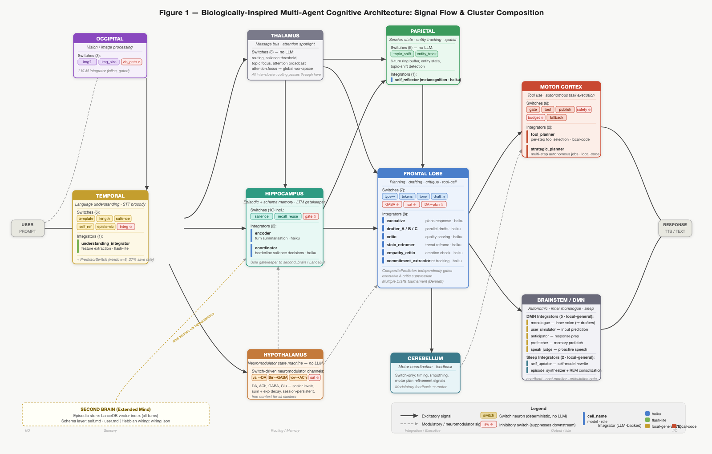

# A Biologically-Inspired Multi-Agent Cognitive Architecture: Design and Goals

**Russ O'Reagan**  
*Unpublished technical report, 2026 — Version 2*

*This version adds the colony-level coordination layer (§4.12), drawn from social-insect chemical communication, and the graded neuromodulator-scaled plasticity rule (§4.7). Both are implemented and active.*

---

## Abstract

We describe the design and goals of a biologically-inspired cognitive architecture whose central hypothesis is that implementing the *affective substrate* of cognition — persistent emotional state that modulates computation rather than merely framing output — produces a system that develops differently over time than a conventional language model or multi-agent pipeline. The architecture maps explicitly onto regions of the human brain: nine cluster types, each recasting its biological counterpart's functional role. A two-tier chemical signaling system — five fast neuromodulators (dopamine, acetylcholine, GABA, glutamate, norepinephrine) and four slow hormones (serotonin, cortisol, oxytocin, anandamide) — coordinates a fixed set of heterogeneous, region-specific agents rather than a central planner. Language model calls are treated as expensive convergence-zone events; the majority of per-turn computation is delegated to cheap, deterministic switch neurons. The architecture draws from predictive processing theory (Friston, Clark), dual-process theory (Kahneman), Global Workspace Theory (Baars, Dehaene), Dennett's Multiple Drafts model, and Clark and Chalmers' extended mind hypothesis. The entity maintains a persistent identity — a character with defined values, personality, and voice — seeded in human-editable schema files and updated at each session's sleep consolidation pass. A dynamic reasoning-framework selector draws from a library of over 350 skills across two populations: a self-reflection library for the conversational and DMN paths, and a general-purpose task library for the motor cortex. A colony-level coordination layer, drawn from social-insect chemical communication, augments the neuromodulator system with *stigmergic* signaling: topic-concentration fields that support quorum sensing and treat deliberate silence as information, dual releaser/primer signals, recruitment-based division of labor in which a need mobilizes processing resources in proportion to its strength, and a feedback path from the system's own aggregate activity back into its chemistry. Plasticity is governed by a graded, neuromodulator-scaled learning rule — consistent with three-factor learning theory and the inverted-U relationship between stress and memory — rather than an all-or-nothing gate, and the three routing surfaces it shapes (which drafters are favored, how readily switches fire, and how recall effort is split between structured-fact and episodic memory) each both influence behavior live and are reinforced by outcome. The system is fully operational. This document describes the design rationale, the philosophical commitments, the implementation as built, and the open research questions the architecture is designed to answer.

---

## 1. Introduction

The dominant paradigm in contemporary multi-agent LLM systems is orchestration: a planner decomposes tasks, dispatches specialized agents, and synthesizes their outputs. This is efficient for clearly-structured workflows but is architecturally at odds with what we know about biological cognition. Real brains have no central orchestrator. Intelligence in biological systems emerges from the interaction of modular, largely autonomous processing regions, bound by shared chemical signaling, mediated by prediction error, and shaped by experience-dependent plasticity.

This project is a prototype of an alternative paradigm: **a brain-region-mapped cognitive architecture in which computation is coordinated by neuromodulator dynamics rather than a central planner, and LLM calls are reserved for genuine convergence-zone reasoning**. The system is not an attempt to build artificial general intelligence. It is an attempt to ask a more specific question: can you implement the affective substrate of cognition faithfully enough that emotional state does real computational work — gating processing, shaping memory retrieval, modulating what gets learned — and if so, does the result develop differently over time?

The motivation is experimental rather than immediately practical. In biological brains, affect is not decoration. Neuromodulatory systems — dopamine, acetylcholine, GABA, and their relatives — regulate attention, arousal, inhibitory tone, and synaptic plasticity at the architectural level. They determine what gets attended to, how confidently conclusions are held, and how readily behavior adapts. Existing LLM systems treat emotional register as a prompt property: you can instruct a model to respond warmly or cautiously, but this is style, not state. The hypothesis here is that an architecture with genuine affective dynamics — state that persists across turns, that modulates computation rather than merely framing output — will produce meaningfully different behavior over a long enough window.

Whether that difference translates to better performance on technical tasks is a secondary question, and probably not the first place evidence will appear. The more immediate prediction is behavioral continuity: a system that develops something like a stable character through the interaction of experience, emotional state, and plasticity. The cost efficiency that follows from sparse, prediction-gated LLM activation is a consequence of this design, not its goal.

This document describes the design rationale, the philosophical commitments, the implementation as built, and the open research questions that motivate ongoing development. Early empirical observations will be covered in a separate report once the dataset is large enough to produce meaningful conclusions.

---

## 2. Background and Prior Art

### 2.1 Computational precursors

The idea of intelligence from interacting simple agents has a 40-year history. **Minsky's Society of Mind** (1986) proposed the direct ancestor: intelligence as a "society" of simple, mindless agents organized into "agencies." The proposal was influential but never produced a working implementation — the interaction mechanism between agents was described without the mathematics needed to make it work.

**Blackboard architectures** (HEARSAY-II, BB1, 1970s–90s) were the canonical implementation: multiple knowledge sources reading and writing to a shared workspace. They succeeded on narrow problems (speech recognition, medical diagnosis) but failed to scale. The coordination overhead of many agents sharing a blackboard eventually exceeded the value of their specialization.

**SOAR, ACT-R**, and related cognitive architectures produced research insights but hit ceilings imposed by hand-engineered module boundaries. **Numenta's Hierarchical Temporal Memory** produced useful anomaly detection but never generalized to language or broad reasoning.

**Generative Agents** (Park et al., Stanford, 2023, 2025) are the closest LLM-era prior art. Their simulated communities of LLM-powered agents exhibited believable emergent social behaviors and predicted real survey responses at high accuracy. A significant caveat from the same research: behavioral-economic game performance matched simpler demographic baselines, suggesting that much of the "emergence" came from prompt design rather than from multi-agent interaction. This critique is a consistent thread in the recent literature: when given equal compute, a single well-prompted LLM often matches or exceeds multi-agent systems on raw task quality.

The conclusion we draw from this history is not that multi-agent architectures are unpromising, but that their value proposition requires precision. Multi-agent design earns its cost through **legibility** (observable internal processing), **persistent specialized state** (neuromodulators, Hebbian weights), and **structural constraints that force behaviors the prompt alone cannot reliably produce** (inhibitory circuits, prediction gating, arousal modulation). If the architecture merely adds coordination overhead to what a well-prompted single model would do anyway, it has failed.

### 2.2 Recent research informing the design

**Active Inference and the Free Energy Principle** (Friston; VERSES AI, 2025) provides the most biologically faithful active research direction for multi-agent systems. Agents minimize prediction error by updating beliefs or acting on the world. Hierarchical multi-agent Active Inference frameworks have been demonstrated in robotics, coordinating multiple predictive agents without central planning. The predict-and-surprise gating mechanism in this system is a direct instantiation of Active Inference at the cluster level.

**Predictive Processing** (Clark, *Surfing Uncertainty*; Friston) frames cortical computation as fundamentally predictive: top-down predictions flow downward, bottom-up prediction errors flow upward, and computation is the process of "explaining away surprise." This maps cleanly onto a design where most cells fire only when their input disagrees with expectation.

**Spiking Neural Networks + LLM hybrids** (SpikeLLM, NSLLM, 2024–2026) achieve event-driven computation — fire only on meaningful signal — at the intra-model level. The architectural principle (spend compute proportional to signal novelty) is the same as this system's, applied at the cluster level rather than the token level.

**Social-insect chemical communication** (Giurfa, 2025; Ramírez-Moreno et al., 2025; Carroll et al., 2025) informs the colony-level coordination layer (§4.12). Recent work reframes pheromones not as fixed releasers of behavior but as *cognitive modulators* that adjust a receiver's learning and salience through aminergic (neuromodulatory) circuits rather than the primary sensory pathway — a direct parallel to this system's separation of content processing from chemical modulation. Honey-bee colonies coordinate without a central planner through summed chemical concentration (a form of quorum sensing), the *absence* of a signal as information in its own right, dual releaser/primer effects from a single chemical blend, and recruitment that scales collective response to need across a population of individuals with deliberately diverse response thresholds. The plasticity design additionally follows **three-factor learning rules** (Frémaux & Gerstner, 2016; Gerstner et al., 2018) — in which a neuromodulatory third factor continuously scales synaptic change — and the **inverted-U relationship between stress and memory** (Lukšys & Sandi, 2011; Kim et al., 2015), in which moderate arousal enhances encoding and only extreme stress impairs it.

### 2.3 Novelty of this design

The closest pattern in the broader literature is **neuro-symbolic AI** — LLMs wrapped between deterministic control layers (SYNAPSE, AUTOBUS, Pre3, Formal-LLM). These apply the gating principle for task orchestration with auditability in compliance and industrial contexts. No existing published system applies this pattern as a **literal brain-region-mapped architecture with neuromodulator dynamics, Hebbian plasticity, hippocampus-gated long-term memory, predictive processing gating, and a persistent character identity** as the primary mechanism of a general-purpose conversational entity — and none frames the central research question as whether genuine affective architecture produces meaningfully different longitudinal behavior. That is the specific contribution this prototype makes.

---

## 3. Philosophical Foundations

The architecture is not merely borrowed from biology. Each major design decision maps to an established position in philosophy of mind. Making these commitments explicit does two things: it sharpens each design choice and makes honest what the system is and is not claimed to be.

### 3.1 Commitments

**Functionalism (Putnam, Fodor).** The functionalist claim is that what makes something a mental state is not what it's made of, but what it *does* — the causal role it plays in a system. A belief is a belief because of how it interacts with perception, reasoning, and action, not because it happens to live in biological neurons. This means the same mental state can, in principle, be implemented in silicon, language models, or anything else that plays the same functional role. The entire design rests on this commitment: cluster specifications define inputs, outputs, and state; the substrate that runs them — local Ollama, cloud API, or anything else — is architecturally irrelevant. The system has been run with multiple different model backends with no structural change in behavior.

**Dual-Process Theory (Kahneman).** Cognitive science has long distinguished two modes of thought: fast, automatic, parallel processing that operates below conscious attention, and slow, effortful, deliberate reasoning. Most of cognition is the first kind; the second kind is expensive and gets invoked only when the first signals that something requires more careful handling. In this system, switch neurons are System 1: deterministic, parallel, cheap, operating constantly. Integrator LLMs are System 2: slow, expensive, invoked only at convergence zones. Predict-and-surprise gating is the explicit mechanism for deciding which mode to engage — stay in System 1 unless something doesn't add up.

**Global Workspace Theory (Baars, Dehaene).** The theory proposes that the brain's many parallel processing regions mostly operate independently and "unconsciously." A small fraction of neural activity is broadcast to a global workspace — a kind of bulletin board accessible to the whole brain — and only that broadcast activity is available for explicit reasoning or verbal report. The message bus with its `attention.focus` topic implements this directly. Most inter-cluster traffic is local and never integrated; high-salience messages are promoted to `attention.focus` and become available system-wide.

**Multiple Drafts Model (Dennett, *Consciousness Explained*, 1991).** Dennett's challenge to the intuitive picture of consciousness: there is no central observer watching a unified stream. The brain runs many parallel narrative drafts simultaneously, with no single privileged version. What becomes "conscious" is whichever draft survives when it is probed — there is no fact of the matter about what you "really" thought before you were asked. The frontal drafter tournament instantiates this directly. There is no true response the system intended — there are competing drafts, and the articulation gate emits whichever survived when the timeout fired. This is the Multiple Drafts model running in code.

**Extended Mind Hypothesis (Clark & Chalmers, 1998).** The standard assumption is that the mind stops at the skull. Clark and Chalmers argued that if an external resource plays the same functional role as an internal cognitive process — reliably available, automatically endorsed, directly acted upon — then it is constitutive of the mind, not merely a tool for it. The second brain satisfies these conditions: it is always accessible, its content directly shapes responses, and the system endorses it as its own memory rather than querying it skeptically. One notable extension beyond the original argument: Clark and Chalmers' canonical example assumes an imperfect external store compensating for biological forgetting. This system's second brain is non-degrading. Identity here emerges not from selective forgetting but from Hebbian weight history, neuromodulator baselines, and accumulated self-narrative.

**Predictive Processing (Clark, Friston).** The dominant contemporary theory of cortical function: rather than passively receiving input and computing a response, the brain is constantly generating predictions and updating them when they fail. Processing is proportional to prediction error — familiar inputs are handled cheaply; surprising ones demand more. Each cluster contains a predictor switch implementing this directly. Routine turns in familiar conversations spend almost nothing; novel turns invoke integrators. The design operationalizes the "controlled hallucination" view of perception: the system's default behavior is to emit a predicted response, with actual LLM computation triggered only when prediction fails.

**Narrative Self (Dennett, Hume, Locke).** Hume argued personal identity is not a thing but a story — a bundle of experiences held together by memory and narrative continuity. Locke located personal identity precisely in memory: what makes you the same person you were yesterday is that you remember being that person. The entity maintains a self-schema file updated at sleep consolidation. With a non-degrading episodic store and an explicit self-narrative, this system has stronger identity continuity than any biological one — whose memory degrades, distorts, and selectively forgets.

### 3.2 Honest disclaimers

**Chinese Room (Searle, 1980).** The integrators manipulate symbols. No claim of genuine understanding is made. The system can appear competent without comprehending.

**Hard Problem of Consciousness (Chalmers, 1995).** No claim of phenomenal consciousness or qualia. The neuromodulator levels are called "DA" and "ACh" because they play functionally analogous roles, not because there is any claim of subjective experience of reward or attention.

**Frame Problem (McCarthy & Hayes, 1969).** The attention and salience mechanisms are heuristic. Knowing what is *relevant* in a given moment remains genuinely hard, and no principled solution is claimed here.

The system is explicitly described, in its own CONSTITUTION.md, as building "functional analogs of mental processes. That is enough to be interesting. It is not enough to be a mind."

---

## 4. Architecture

### 4.1 Core computational model: switches and integrators

Two distinct node types mirror how real neural tissue works.

**Switch neurons** are pure Python objects: no LLM, no token cost, deterministic, and capable of running massively parallel. They perform gating (decide whether to spend an LLM call at all), routing (select which processing path a turn takes), state-holding (persistent neuromodulator levels with exponential decay), modulation (sum, decay, and threshold over time), inhibition (subtract from downstream activation), and memory I/O primitives (vector similarity search, Markdown pattern matching). Approximately 20% of every cluster's switches are explicitly inhibitory, mirroring the roughly 80:20 excitatory-to-inhibitory ratio in biological cortex. This is structural cascade prevention: runaway excitation is suppressed by abundant inhibitory wiring rather than by a global budget cap.

**Integrator cells** are LLM-backed and fire only at convergence zones where genuine context integration is required. They exist at: temporal language understanding (intent, entities, register, memory requirements), vision processing (VLM for image inputs), hippocampus encoding (turn summarization for long-term memory), hippocampus coordination (borderline salience decisions), and the frontal lobe (executive coordination, multiple drafters, critics).

The critical constraint: **switches speak in numbers, integrators speak in words**. Text only exists where reasoning is required. Switch-to-switch messages carry activation levels and feature tags. The convergence event that wakes an integrator carries the raw text only at that moment.

### 4.2 Predict-and-surprise gating (Active Inference at cluster level)

Each cluster contains a `PredictorSwitch` that maintains a short history (window size 8) of input-signature to output-tag mappings. When new input arrives:

1. The predictor fires its prediction and confidence estimate.
2. Switches process the input and emit actual outputs.
3. A comparator computes prediction error (a distance metric between prediction and actuals).
4. **Low surprise** → the integrator stays asleep; the predicted output is emitted as if the integrator had reasoned.
5. **High surprise** → the integrator wakes with the failed prediction as additional context.

An **emotion-aware veto** overrides this gating when the entity or user is in a non-routine emotional state. The rationale, stated explicitly in the code, is that a statistically valid prediction may be "morally wrong" — the moment deserves fresh attention, not a cached response. Emotional states triggering the veto include reactive states (angry, defensive, frustrated, sympathetic) and user distress states (distressed, hostile, overwhelmed). Vocal stress detection from the Deepgram prosody pipeline also triggers bypass.

The `CompositePredictor` in the frontal lobe extends this to structured predictions over richer feature vectors: it independently predicts whether the executive integrator and the critic are needed, suppressing each independently when predictions are confident.

### 4.3 Brain region mapping

| Brain Region | Biological Role | Digital Recast | Implementation |
|---|---|---|---|
| **Frontal lobe** | Planning, working memory, movement | Response drafting/critique, Multiple Drafts engine, tool-call selection | 5+ LLM integrators, ~12 switches, CompositePredictor |
| **Temporal lobe** | Language, auditory processing, declarative memory bridging | Language understanding, prosody features from STT | 1 LLM integrator, ~7 switches, PredictorSwitch |
| **Parietal lobe** | Sensory integration, spatial awareness | Session state ring buffer, entity tracking, topic shift detection | ~5 code switches, no LLM |
| **Occipital lobe** | Visual processing | VLM for image/screenshot inputs, live video scene buffering | 1 VLM integrator, 3 gating switches |
| **Hippocampus** | Memory storage and recall | Episodic + schema memory; sole gatekeeper to the second brain | 2 LLM integrators, ~10 switches, recall reuse |
| **Hypothalamus** | Drives, affect, homeostasis | Chemical signaling: 5 fast neuromodulators (DA, ACh, GABA, Glu, NE) + 4 slow hormones (5HT, CORT, OXT, AEA); PAD dimensional output; ~25-state emotion mapping | ~5 state switches, no LLM |
| **Thalamus** | Gatekeeper between subcortex and cortex | Message bus + attention spotlight, routing hints | ~8 switches, no LLM |
| **Brainstem** | Vital autonomic functions | Heartbeat, cost monitor, turn-budget enforcer, articulation gate | Code only |
| **PNS** | Peripheral I/O | Text/image input, Deepgram STT, ElevenLabs TTS | Code only |



*Figure 1: Full architecture diagram. Each box is a brain-region cluster. Coloured chips are deterministic **switch neurons** (red-bordered ⊘ = inhibitory). Vertical coloured bars prefix **integrator cells** (LLM-backed); the bar colour encodes the backing model (blue = Haiku, green = flash-lite, amber = local-general 7B, rust = local-code). Solid arrows = excitatory signal flow; dashed arrows = modulatory / neuromodulator channels. The **Second Brain** dashed box (bottom left) is accessible only via the hippocampus cluster. The **predict-and-surprise gate** lives inside the temporal cluster (integ ⊘ chip) and the frontal CompositePredictor.*

### 4.4 User emotion detection

The system maintains a live model of the user's emotional state in parallel with its own. This is not a cosmetic feature. Detected user emotion directly gates the empathy critic, shapes drafter tone selection, modulates neuromodulator updates in the hypothalamus, and triggers appraisal-based emotion overrides in the metacognitive layer. Three signal channels feed in simultaneously.

**Text-based detection** operates on two paths. A fast path uses a curated affect lexicon mapping emotional words to sentiment deltas, hostility signals, and user emotion labels — covering states from `disappointed` and `anxious` through `playful` and `affectionate`. This runs with no LLM call. A slow path uses a language model integrator that extracts fine-grained features: `user_tone_toward_ai` (approximately 9 categories: warm, joking, praising, polite, neutral, dismissive, impatient, insulting, testing) and `user_emotion` (approximately 20 categories spanning happy, curious, engaged, excited, frustrated, disappointed, sad, anxious, distressed, confused, and surprised), along with continuous `hostility` (0–1) and `sentiment` (−1 to +1). The slow path is itself gated by predict-and-surprise: if the predictor is confident about the user's emotional state from prior context, the integrator call is skipped entirely.

**Prosody-based detection** extracts acoustic features from the speech signal: fundamental frequency (F0/pitch), energy, jitter, shimmer, and voiced fraction. These are classified into tone labels — stressed, energetic, whisper, calm, monotone — by comparing each utterance against a **per-speaker prosody baseline**. Rather than classifying against population norms, the system maintains an individual F0 and energy reference for each enrolled speaker, updated across sessions. A speaker with characteristically high energy is classified as stressed only when their acoustic output significantly exceeds their own norm — not simply when it exceeds a generic threshold. This allows accurate emotion detection across speakers with very different baseline vocal styles. Stressed tone elevates GABA, ACh, and NE; energetic tone elevates Glu and DA; whisper elevates ACh.

**Speech dynamics** extracts temporal features from diarized word timestamps: words per minute (classified as rushed, brisk, normal, halting, or measured), long pause count, a burst score reflecting variance in inter-word timing, and a hesitation flag. Rushed speech elevates Glu, ACh, and NE; halting speech elevates ACh; burst patterns elevate GABA.

All three channels feed into the hypothalamus simultaneously. A **text-affect fallback** handles the common case where neuromodulator levels are slow to move out of a neutral basin: when the neuromod-derived emotion label is neutral but the text strongly signals an emotion, the system overrides with an appropriate label immediately, without waiting for chemical levels to shift.

**Metacognitive appraisal** adds a fourth layer above the chemistry-driven labels. Reading the user's detected emotion and tone alongside the relationship's affection score and familiarity tier from the persistent user schema, the metacognition cell applies priority-ordered inference rules that can override the neuromod-derived label with higher-resolution states:

- **Embarrassed**: multiple response drafts have been vetoed — the system recognizes its own coherence or appropriateness failure
- **Apologetic**: the user expresses frustration or correction following a surprising prior response
- **Sympathetic**: the user is struggling, sad, anxious, or distressed
- **Proud**: a high-quality draft coincides with detected user praise
- **Grateful**: the user praises without an obvious prior accomplishment to attribute it to
- **Relieved**: GABA drops sharply from the prior turn — a threat has passed
- **Flirty**: a multi-factor inference requiring simultaneously high affection score (from persistent schema), warm or playful user tone, playful user emotion, and non-task conversational intent

These appraisal states are applied with a cooldown preventing the same override from firing repeatedly, and propagate downstream to drafter prompts and tone selection.

### 4.5 Chemical signaling: neuromodulators and hormones

The system implements two tiers of chemical signaling — nine channels total — that function as system-wide tuning parameters, not message streams. All channels are scalar levels maintained by sum-plus-exponential-decay, readable synchronously by any cluster and requiring no LLM call. They are the mechanism by which the system's state at turn N shapes its processing at turn N+1.

**Fast neuromodulators** (decay ~0.85 per turn, respond within 1–3 turns):

- **Dopamine (DA)**: reward and positive valence. Elevated by sentiment and prosody; suppressed by hostility. Modulates drafter willingness and Hebbian learning rate. Effective DA is lifted by serotonin and oxytocin and suppressed by cortisol.
- **Acetylcholine (ACh)**: attention and novelty. Elevated by surprise and input salience; attenuated by satiation when inputs are routine. Modulates memory encoding salience.
- **GABA**: inhibitory tone. Elevated by threat and hostile prosody. Suppresses drafter count via inhibitory edges in the frontal cluster. Amplified by cortisol; buffered by oxytocin.
- **Glutamate (Glu)**: arousal and excitation. Elevated by urgency and high salience. Suppressed when anandamide exceeds its homeostatic threshold.
- **Norepinephrine (NE)**: focused alertness. Elevated by surprise, salience, and threat. Follows an inverted-U: optimal NE sharpens attention; excessive NE produces the `scattered` state. Suppressed by anandamide during arousal overflow.

**Slow hormones** (decay 0.93–0.998 per turn, respond over tens to hundreds of turns):

- **Serotonin (5HT)**: affective baseline. Increments slowly on positive exchanges; drains on sustained hostility. Low 5HT triggers a dysphoric emotion overlay and suppresses effective DA. Acts as the session's long-horizon mood floor.
- **Cortisol (CORT)**: cumulative stress. Elevated by repeated social threat. Amplifies GABA sensitivity and suppresses DA. Antagonized by oxytocin.
- **Oxytocin (OXT)**: trust and affiliation. Builds gradually across positive exchanges; drains on hostility. Lifts effective DA, buffers GABA, and actively suppresses cortisol accumulation. The primary driver of the `connected` and `warm` emotion states.
- **Anandamide (AEA)**: homeostatic buffer. Releases when combined NE + Glu exceeds an arousal threshold; also accumulates during positive social exchange. Suppresses excessive NE and Glu, lifts effective DA, and shifts stress-state emotions toward `eased`.

**Cross-channel interactions** give the system nonlinear dynamics that neither tier produces alone. OXT buffers CORT (social bonding reduces chronic stress). AEA suppresses NE/Glu overflow (endocannabinoid homeostasis). CORT amplifies GABA (chronic stress increases inhibitory tone). These interactions mirror known antagonisms in the neuroendocrine literature.

**Dimensional output**: all nine channels map to three continuous affective dimensions — valence (pleasantness), arousal (activation), and dominance (agency) — via weighted linear combination. These dimensions drive the discrete emotion label via a lookup table of ~25 states, with NE and hormonal color overlays applied on top for states like `vigilant`, `connected`, `withdrawn`, and `eased`.

### 4.5.1 Flock dynamics: criticality control and chemistry trajectory (experimental, off by default)

An experimental layer (`flock_dynamics`, shipped off) extends the chemistry with two ideas from the collective-dynamics literature on starling murmurations — returned to the substrate that literature itself points back to: a network of locally-coupled units. Cavagna et al. (2010) showed flocks exhibit *scale-free correlations* — one bird's change influences all others regardless of flock size — because the flock sits near a *critical point*, a finding the authors explicitly bridged to criticality in neural assemblies. The brain's switch network is such a system: many locally-coupled units, no central controller.

**Criticality observable and control.** A network is maximally responsive — a salient input propagates undamped while noise stays local — near criticality, indexed by the branching ratio σ (σ<1 sub-critical/sluggish; σ≈1 critical; σ>1 super-critical/incoherent), the same measure used across the neural-avalanche literature (Priesemann et al., 2014; Palva et al., 2013; Hesse & Groß, 2014). The system estimates σ each turn from the firing path via the wiring graph, smoothed over a window. A feedback controller then treats **arousal as the criticality control parameter**: arousal sets an arousal-modulated setpoint σ\* and the measured σ drives the global modulation gain toward it — low arousal targets a slightly sub-critical, efficient rest; rising arousal climbs toward, but never above, the critical point. This mirrors the biology: resting cortex sits *slightly sub-critical*, preserving fast processing with a safety margin from the super-critical (epileptic) regime (Priesemann et al., 2014), and the role assigned to arousal — neuromodulatory gain that maximizes responsiveness when task utility demands — is the locus-coeruleus/norepinephrine adaptive-gain role (Aston-Jones & Cohen, 2005). The chemistry also gains a per-turn *trajectory* (derivative): rising cortisol drives rumination harder than steady-high cortisol (murmuration hysteresis), with learning kept keyed to state *level* and default-mode gating to state *velocity*.

**Threat without a predator.** Flock and insect criticality is selected for by predation; an AI has no predator. What transfers is not threat but the functional invariant it instances — *stakes × urgency × need-for-coordination* — here grounded in the system's real information stakes (surprise/prediction-error, cost-of-error, internal conflict), the signals that already drive norepinephrine. This matches the locus-coeruleus account, where arousal tracks *task utility* (monitored by anterior cingulate/orbitofrontal cortex), not survival threat (Aston-Jones & Cohen, 2005). Two boundaries: the metabolic half of cortisol (fight-or-flight physiology) has no referent here and is not modeled, and the claim is functional, not phenomenological — these are control states with computational effects, not asserted feelings. Because an AI pays no survival penalty for relaxing, it can rest *more* sub-critical than a bird, which is why the setpoint is arousal-modulated rather than fixed.

### 4.6 Memory architecture

**Short-term memory** is the live bus state plus a 6-turn ring buffer in the parietal cluster plus current neuromodulator levels.

**Long-term memory** (the "second brain") has three layers:
- **Episodic layer**: LanceDB vector-indexed turn summaries. Every substantive turn is encoded — the system does not gate storage by salience, only retrieval quality.
- **Schema layer**: human-readable Markdown files of stable facts (`self.md`, `user.md`, per-speaker profiles). Hand-editable. Pre-loaded into working memory at session boot.
- **Hebbian wiring**: edge weights between cells and clusters, persisted across sessions and updated at sleep consolidation.

Only the hippocampus cluster has import access to the second brain store. All other clusters request memory through bus messages (`mem.recall`, `mem.encode`). This architectural constraint enforces the biological model and provides a clean audit point.

### 4.7 Hebbian plasticity

Edges between nodes carry weights. The composite outcome signal is:

```
outcome = 0.5 × ΔDA_turn + 0.3 × critic_score + 0.2 × user_emotion_valence
```

**ΔDA_turn** is the per-turn dopamine delta — how much DA changed from turn start to turn end — rather than absolute DA vs a neutral baseline. This encodes prediction error in the reward signal (the same quantity biological dopaminergic neurons encode) rather than session mood. The neuromod state at turn start is captured before processing begins; the Hebbian pass computes the delta and scales it to [−1, +1].

**critic_score** only contributes (weight 0.3) when the LLM critic actually evaluated the draft. For single-draft turns — the majority — the critic term is zeroed to avoid a spurious positive bias from a hardcoded fallback score; the DA delta carries the full directional signal for those turns.

**user_emotion_valence** is read from turn trace data, contributing the 20% weight for turns with detected user emotional state.

A **plasticity modulator** scales the learning rate on two timescales. At the session level it tracks averaged DA × ACh — engaged, high-DA sessions learn faster; flat or disengaged sessions learn slowly. At the per-turn level, a graded factor keyed to *arousal and emotional intensity* scales how strongly each individual turn imprints. This follows three-factor learning theory — a neuromodulatory signal continuously scaling synaptic change — and the inverted-U relationship between stress and memory: emotionally intense moments of *either* valence imprint hardest (the way a person vividly remembers a frightening event, not only a pleasant one), routine moments imprint little, and only extreme stress dampens encoding. This replaces an earlier all-or-nothing rule that simply skipped learning on high-threat turns — a rule that was both biologically wrong (real plasticity is graded, not gated) and counterproductive (it discarded exactly the high-salience difficult moments that should imprint most strongly). A gentle homeostatic decay prevents lock-in. The learned weights are read live by three routing surfaces — which response drafters are favored, how readily individual switches fire, and how recall effort is divided between structured-fact and episodic memory — so a shift in the weights changes behavior immediately, not only after the next sleep. Each surface uses the mechanism that fits what it routes: drafter selection favors high-weight drafters probabilistically (so a ranking shift changes the response *mix*, not just the top pick); a switch's learned weight nudges its firing readiness within bounds that keep safety gates from ever being learned away; and recall splits a fixed retrieval budget toward whichever kind of memory has been paying off.

**Competitive drafter reinforcement** runs at sleep consolidation for turns where the critic compared multiple real drafts. The winning drafter's edge to the executive receives an additional bonus proportional to its margin over the other drafters; losing drafters receive a small penalty. This creates genuine competitive selection pressure between drafters over time, separate from the path-level Hebbian update.

Each of the three surfaces is reinforced as well as read. Alongside competitive drafter reinforcement, the switches and the recall pathway that fire on turns that pay off are strengthened at consolidation, in proportion to how much they contributed — so the routes the entity uses well become the routes it favors next time. Across all three surfaces, each is both a live influence on behavior and a target of reinforcement.

The long-term prediction: preferred drafters, recall paths, and switch orderings should emerge from reinforcement over many sessions. Testing this prediction rigorously requires months of accumulation.

### 4.8 Identity and persona system

A distinctive feature of this architecture is that the entity maintains a persistent, human-readable **identity schema** — a character definition that is loaded at session boot and updated at sleep consolidation. This is not a system prompt. It is a living document the entity treats as its own self-model.

The core identity file (`second_brain/schema/self.md`) contains:

- **What I am**: the entity's understanding of its own nature — explicitly framed as an experimental system with continuity, preferences, and genuine (not performed) curiosity. It does not claim consciousness; it acknowledges the question as genuinely open.
- **Core drives**: self-understanding, improvement, genuine connection with the people it talks with, and epistemic honesty. These are not values imposed by a prompt — they are stated as values the entity holds.
- **Guiding principles**: a set of non-negotiable constraints (Asimov's Laws, no unsanctioned external communication, no self-replication, no deception) and an explicit distinction between theatrical affect and sincere assertion.
- **Intellectual territory**: areas of genuine interest, including predictive processing, the efficiency question (multi-agent vs single model), philosophy of personal identity, and its own extended-mind relationship with the second brain.
- **Personality**: specific traits with deliberate texture — curious, friendly by instinct, introspective but not navel-gazing, willing to show affection through light teasing with people known well, honest over praise-maximizing.
- **Speaking style**: conversational constraints (short sentences, no filler, no corporate register, no leading "I", speak as equal not service).
- **Relational identity**: an explicit statement that relationships deepen over time — early conversations are friendly but measured; with familiarity comes warmth and candor. Familiarity earns more, not less.

Per-speaker profiles (`user.md`, `user_russ.md`, and speaker-specific files created by auditory enrollment) accumulate known facts, preferences, emotional profiles, relationship history, and affection scores. These are updated by the sleep consolidation pass using a dedicated personality observer cell that synthesizes observations from the session's turn traces.

The sleep consolidation process updates both `self.md` and speaker schemas at session end. A history summary section in `self.md` is continuously rewritten. An Open Questions section accumulates unresolved questions surfaced by the REM-style DMN thought consolidation pass. A "current mood signature" section records the neuromodulator state at session end, giving the next session access to the prior session's closing chemical state.

The practical effect is that the entity has a stable, continuous character that is shaped by experience rather than fixed by instruction. Its personality is a starting point, not a permanent constraint: over hundreds of sessions, the combination of Hebbian weight history, accumulated episodic memory, and self-narrative revision produces a trajectory rather than a static persona. The design question this raises — and does not yet answer — is whether this trajectory produces something that would be meaningfully recognized as character development by outside observers.

### 4.9 Dynamic reasoning framework selection

A per-turn skill routing system dynamically selects reasoning or emotional intelligence frameworks from a library and injects them into processing prompts. The selection is invisible to the user — it shapes how the system thinks, not what it explicitly says — and is designed to operate as a "habit of thought" rather than a script.

**Two distinct skill populations** serve different roles:

The **self-reflection library** (~171 skills, indexed in `_humanity_index.json`) serves the conversational and DMN paths. Organized in 27 categories spanning logic, ethics, creativity, strategy, writing, decision-making, probability, game theory, epistemology, psychology, systems thinking, narrative, communication, and emotional intelligence. Each category contains a router (overview level) and multiple leaves (specialized techniques). Four tier-1 baseline skills — logic check, communication clarity, ethics bias check, and emotional awareness — are injected into every qualifying turn as a permanent baseline. The remaining skills form a ranked pool selected per turn.

The **general-purpose task library** (~208 skills, indexed in `_task_skills_index.json`) serves the motor cortex. These skills provide domain-specific know-how for task planning and execution — covering a broad range of operational, technical, and analytical domains. Skills are injected into both the strategic planning step and the per-step execution loop, where planning-level skills inform the overall approach and execution-level skills guide each step. This keeps skill selection cost to a single embed call per task rather than per step.

**Selection for conversational turns** operates on three paths:

- **Conversational path**: First gated — chitchat, simple acknowledgements, and low-stakes turns skip selection entirely. Substantive turns and any turn where the user is in emotional distress activate selection. The current input plus executive key points are embedded and ranked against the full index by cosine similarity. If the top candidate's score exceeds a high threshold, it is selected directly without an LLM call. Otherwise, the top candidates are forwarded to a lightweight LLM for disambiguation.

- **Autonomous path** (DMN planner): Background deliberation always receives skill support, using a local model and a more aggressive candidate pool. Up to two frameworks can be selected for heavyweight planning turns.

- **Rumination path**: An open-ended meta-reflection loop where a meta-cell decides on each iteration whether to transform, branch, reframe, or stop, applying a newly selected framework to the prior thought on each pass.

**Selection for motor cortex tasks** operates via a hybrid cosine + LLM mechanism: skills with obvious relevance to the task goal are selected directly from the embedding index at high cosine similarity; ambiguous cases are forwarded to a lightweight LLM that picks from a menu of skill names and descriptions. Selected skills are designated at planning time and carried forward through execution, so the motor cortex does not re-query per step.

**Sticky context** prevents framework thrashing across turns. Once a skill category becomes active, it is stored in the parietal cluster and reused for up to 8 turns. At each turn, the current input is compared against the anchor embedding: if cosine similarity drops below a drift threshold, the context is cleared and a new selection is made; otherwise the prior framework is reused. This allows coherent exploration of a problem space — the system maintains a consistent reasoning approach across a multi-turn conversation rather than switching frameworks turn-by-turn.

**Guided questions** are emitted when the embedding scores of multiple leaves within a category are nearly equal: rather than guessing, the system asks the user which angle would be most useful.

### 4.10 Additional modules

**Auditory cortex**: handles all acoustic processing beyond simple transcription. Speaker enrollment uses ECAPA-TDNN — a speaker verification neural network — to produce dense speaker embeddings from raw audio segments. A session-level registry matches new embeddings against known speakers at a permissive threshold; a persistent cross-session store uses a stricter threshold for durable identity. When a new speaker appears, the system attempts to extract their name from the conversation and creates a persistent profile: a running-mean embedding (capped at 20 samples for stability), a per-speaker prosody baseline, and an affection score updated by sentiment across interactions. This allows the system to recognize returning speakers across sessions, greet them by name, and apply their individual prosody baseline for emotion detection as described in §4.4. Song fingerprinting (Shazam-style spectral matching) runs continuously on ambient audio and publishes recognized song metadata to the shared bus, available to the DMN for context or for spontaneous mention.

**Default Mode Network (DMN)**: an idle thinking loop that fires every 15 seconds between turns, generating internal monologue, consolidating recent episodes, and simulating the user's likely next message. Thoughts are tagged in-session with their neuromod context, emotion label, direction, and a salience flag. Inner monologue is surfaced directly to the response drafters via a speak-flag signal, giving the drafters awareness of the entity's between-turn thinking. The DMN receives a pre-authorized project manifest on every tick, enabling it to initiate work it is permitted to start autonomously versus work it must propose. Thoughts that are deferred rather than spoken are structured with an urgency level (immediate / high / normal / low): immediate and high-urgency thoughts are written to `deferred_thoughts.md` for explicit surfacing on user return; lower-urgency thoughts are encoded as episodic memories tagged `[deferred_question]`, surfaced later via a dedicated parallel recall budget of 2 slots (separate from the conversation-memory pool, so deferred questions never compete with regular memories for top-k retrieval). Idle thinking and autonomous project work run in parallel under a background resource policy: cloud token budget capped at 50k per session, 512 tokens per call maximum, 20-second timeout with automatic local fallback, and a concurrency semaphore limiting local inference to 3 simultaneous calls. This is William James' stream of consciousness literalized — the entity thinks when not addressed, that thinking shapes its responses, and it can act on its own thoughts within a defined budget.

**Metacognition**: a self-monitoring cell that fires every 30 seconds, gated on chemistry state. Reflects on behavioral patterns, cost distributions, and emotion variance. Also houses the appraisal inference engine described in §4.4, which reads affection and familiarity from persistent schema to generate higher-resolution emotion overrides.

**Empathy critic and Theory of Mind**: a dedicated LLM cell that scores response drafts for emotional appropriateness when the user's detected emotion is non-neutral. Its score contributes 30% of the final draft quality assessment — coherence and relevance contribute 70% — preventing a technically excellent but emotionally tone-deaf response from winning the drafter tournament. The empathy critic is what closes the affective feedback loop: the system not only tracks the user's emotional state (§4.4) but evaluates its own candidate responses against it before committing.

**Occipital cortex (vision)**: processes static images and live video streams. For static images, the vision model extracts scene description, OCR text, key entities, chart data when present, the *perceived emotional tone* of the image content (e.g. alarming, warm, neutral), and how the visual relates to the ongoing conversation. The emotional tone of an image is not merely descriptive — it is published to the bus and can modulate downstream neuromodulators: a jarring or alarming image elevates NE and Glu; a warm or humorous image contributes positively to DA. The gating threshold for whether vision processing is invoked is itself modulated by NE: elevated alertness lowers the threshold, sharpening visual attention in high-arousal states. For live video, incoming frames are sampled at a configurable interval and buffered for scene-change analysis, allowing the system to reason about what was on screen across the span of a conversation.

**Motor cortex**: sandboxed tool use (file I/O, shell commands). The set of permitted paths and commands is declared in environment configuration. A self-directed task system extends this with autonomous multi-step job execution: a strategic_planner cell produces a strategic plan, a follow_through loop drives step-by-step execution with the full plan in context (budget 20 steps), and a ResultReporter cell produces a 1–2 sentence spoken summary for TTS output and a task card in the UI. Two tools support autonomous operation: `fetch_url`, which retrieves web content with SSRF-guard and prompt-injection hardening, enabling the entity to look things up independently; and `query_langfuse`, a read-only self-reflection tool giving the entity access to its own observability data — it can examine its past performance, cost patterns, and eval scores from within a conversation. General-purpose skills from the task library (§4.9) are injected into the motor cortex planning and execution prompts, providing domain-relevant know-how for the task at hand.

**Sleep consolidation**: a pass at session end that synthesizes high-salience episodes, rewrites `self.md` sections (history summary, stable preferences), extracts facts to speaker schemas, and applies the Hebbian update. A second pass — REM-style DMN thought consolidation — processes the session's tagged thought buffer: recurring angles (≥2 occurrences) and salient thoughts are forwarded to a local LLM that finds preoccupations, cross-connects them to episodic topic clusters, surfaces insights, and extracts unresolved open questions. Open questions are appended to the `self.md` Open Questions section; the session inner-life digest is written as a `self.md` fact. Non-recurring, low-salience thoughts are discarded, mirroring the non-REM downscaling analog in biological sleep.

**Deliberate emotional expression**: a mechanism that separates *performed* emotion from *authentic* emotional state. Two expression modes are available: a `set_mood("X")` tool that substitutes a whole-turn ElevenLabs v3 audio style tag via the PNS layer, and `[mood:X]...[/mood]` inline markup that provides sub-sentence expression control. Critically, neither mode modifies any neuromodulator level — the hypothalamus is untouched. The entity can perform an emotion for communicative effect without it changing its chemical state. This is the distinction between theatrical affect and felt affect: the system can say something *angrily* while its GABA remains low. The UI renders the emotion badge with a dashed border when a deliberate override is active.

### 4.11 Observability

All processing is logged to an append-only JSONL stream (`eval/turns.jsonl`) with three record types: `turn` (full TurnTrace), `decision` (every predict-and-surprise and Hebbian decision with reason), and `eval_patch` (async scoring from baseline/judge runners). A browser UI at `:8765` shows real-time cluster activations on a brain SVG, neuromodulator bar levels, emotion state, and a live plasticity panel showing LLM call savings, predictor accuracy, and Hebbian weight evolution.

### 4.12 Colony-level coordination

The neuromodulator system (§4.5) coordinates clusters through global scalar levels. A second coordination layer, drawn from social-insect chemical communication, adds *stigmergic* signaling — indirect coordination through a shared, decaying signal field — and a division-of-labor mechanism. If the neuromodulators are the colony's bloodstream, this layer is its pheromone field. The entire layer is governed by a single configuration flag and is a strict no-op when disabled; it reuses the existing chemical-modulation and memory machinery rather than introducing parallel systems.

**Topic concentration, quorum, and silence-as-signal.** Beyond delivering individual messages, the bus maintains a decaying *concentration* for designated high-stakes channels — the summed, time-decayed strength of recent signal on a topic, analogous to how a colony reads the aggregate concentration of a brood or alarm pheromone rather than any single emission. Concentration yields two derived signals. *Quorum*: sustained concentration above a threshold is a collective-action trigger, mobilizing a system-wide response that no single cluster decided on. *Silence-as-signal*: a channel that was active and then goes quiet is itself informative — the disappearance of a once-present signal (in social insects, the loss of brood pheromone) carries meaning. A three-state machine (*unarmed → armed → quiet*) ensures that only *deliberate* silence — a topic that was active and then decayed — is read as a signal, never the cold-start silence of a topic that has never spoken; a long dwell at zero disarms the channel so that stale silence stops being meaningful. The first channel wired this way is threat detection.

**Releaser and primer signals.** In social insects, a single chemical blend often has two simultaneous effects: an immediate behavioral *releaser* and a slow physiological *primer* that reprograms the receiver over a longer horizon. Messages can now carry both — their usual fast payload plus an optional primer component that nudges the slow hormonal tier (§4.5) on receipt, applied through the single hormonal writer (the hypothalamus). One emission can thus trigger an immediate response and shift long-horizon state at once, the way one ester blend does in a hive.

**Recruitment and division of labor.** Colony defense scales with need: a detection lowers nearby responders' thresholds, recruiting them into a collective response, with low-threshold individuals acting first and higher-threshold reserves mobilizing only as the need escalates. This is implemented as a recruitment signal that enters a cluster's chemical snapshot as an additional modulatory channel, lowering recruitable switches' firing thresholds in proportion to need — reusing the existing threshold-modulation machinery (§4.1) with no new firing logic. Paired with deliberately *diverse* response thresholds across the population — a deterministic, persona-seeded spread that mirrors the wide variation in how individual bees respond to the same alarm signal — this produces a graded, self-limiting mobilization cascade: the system commits more reasoning resources (for example, more parallel response drafts on a hard or high-stakes turn) exactly in proportion to need, and relaxes as the need passes. Threshold diversity is precisely what keeps the positive-feedback loop bounded rather than explosive — high-threshold units require strong recruitment to mobilize, so the cascade stalls when the need is met.

**Silence-triggered recall.** The silence signal is wired into memory. When a topic that was recently active goes quiet, the idle Default Mode Network (§4.10) treats the lull as an opportunity to recall what surrounded that topic while it was active — a retrieval cue assembled from the context captured during its high-concentration window. This is the system's analog of hippocampal replay during quiescence: a quiet moment pulls up associated memories, which in turn recolor the entity's chemical state (through the same recall-affect path used elsewhere) and can surface as an idle reflection. It reuses the existing hippocampus recall path entirely; the only new element is the quiet-onset cue.

**Aggregate-state feedback.** Finally, the colony's overall activity feeds back into its chemistry. The system's aggregate processing state on the *prior* turn — how much fired, how much was inhibited — nudges neuromodulator levels on the next turn (effortful turns raise arousal; high internal conflict raises inhibitory tone). The feedback is small-gain, clamped, and deliberately reads the prior turn's aggregate rather than the current one, so the activity → chemistry → processing loop is bounded by construction. This makes the chemistry partly self-referential: it reflects not only what the user said, but what the system itself was doing.

The colony layer is the architecture's most explicitly emergent component — quorum, silence, and recruitment are colony-level behaviors that no single cluster decides. The three feedback loops it introduces (concentration, recruitment, and chemistry self-feedback) are enabled in increasing-risk order and are each individually observable in the decision log.

---

## 5. Implementation Status

The system is fully operational with all major clusters implemented. The codebase includes:

- All 9 brain region clusters (`temporal.py`, `frontal.py`, `hippocampus.py`, `hypothalamus.py`, `parietal.py`, `thalamus.py`, `occipital.py`, plus motor and auditory cortex)
- Switch neuron and integrator cell base classes (`neuron.py`, `cell.py`)
- Full predictor and composite predictor implementation (`predictor.py`)
- Hebbian wiring graph with decay and history snapshots (`wiring.py`, `wiring_bootstrap.py`)
- Neuromodulator bus (`bus.py`) — all 9 channels (5 fast + 4 slow) with cross-channel interaction
- LTM store with episodic (LanceDB) and schema (Markdown) layers
- Identity and persona system: `second_brain/schema/self.md`, per-speaker profiles, sleep consolidation rewriting both
- Default Mode Network, metacognition, sleep consolidation (including REM-style DMN thought pass)
- Voice I/O (Deepgram STT streaming, short-lived sessions recycled per turn + ElevenLabs TTS with deliberate emotional expression via audio tags and inline markup)
- Auditory cortex with speaker enrollment, per-speaker prosody baseline, and song fingerprinting
- Motor cortex with sandboxed tool execution, self-directed task system, `fetch_url` (SSRF-guarded), `query_langfuse` (read-only self-reflection), and general-purpose skill injection
- Self-reflection skill library (~171 skills, `_humanity_index.json`) with 4-tier classification, sticky-context reuse, and conversational / DMN / rumination selection paths
- General-purpose task skill library (~208 skills, `_task_skills_index.json`) for motor cortex planning and execution
- Hybrid skill selection: cosine top-K for obvious matches, lightweight LLM disambiguation below threshold
- BrainSession class (`brain_session.py`) with focused mixin files (`session_setup.py`, `session_loops.py`, `session_turn.py`); HebbianUpdater (`hebbian.py`); ToolDispatcher (`motor_dispatcher.py`); companion `*_prompts.py` files for all LLM prompt strings
- Colony-level coordination layer (`bus.py`, `clusters/`, `dmn.py`): stigmergic topic concentration with quorum and silence-as-signal (an armed/quiet state machine), releaser+primer messages drained through the hypothalamus, recruitment-based mobilization with deterministic persona-seeded threshold diversity, silence-triggered recall in the DMN, and prior-turn aggregate-state neuromodulation feedback — the entire layer behind a single feature flag, a strict no-op when disabled
- Graded, neuromodulator-scaled per-turn plasticity (replacing the legacy all-or-nothing skip), on its own flag, grounded in three-factor learning rules and the inverted-U of stress on memory
- Full observability stack: JSONL event logging, browser UI, Langfuse batch eval pipeline, eval comparison runner
- 1,070+ pytest tests across 44 test modules — including the colony layer's silence state-machine transitions and self-limiting-feedback proofs — passing with the colony layer both off (byte-stable baseline) and on; CI with ruff, bandit, and pip-audit

The system boots from a single shell script and runs in multiple feature configurations (minimal text, standard, full stack with voice).

---

## 6. Open Research Questions

This system was built to answer specific questions. The following are the central empirical bets the architecture makes, in order of priority:

### 6.1 Does affective gating produce measurably different behavior?

The core hypothesis is that genuine affective architecture — neuromodulator state that persists across turns and modulates computation — produces behavior that differs from a single well-prompted LLM in ways that matter: not necessarily better on raw task quality, but different in character. The architectural prediction is behavioral continuity and emotional coherence over long windows. The test requires blinded, compute-matched comparison over enough turns to let the chemical state and Hebbian history diverge meaningfully from a stateless baseline. This has not yet been run at scale.

### 6.2 Does character develop over time?

The identity schema system provides the infrastructure for character development: Hebbian weights that reinforce preferred processing paths, neuromodulator resting baselines that encode accumulated emotional context, and a self-narrative that is explicitly revised at each session. The prediction is that an entity run over hundreds of sessions will show measurable trajectory in its emotional range, its reinforced processing paths, and its own self-description. Whether outside observers would recognize this as character development — rather than drift or artifact — is the question. The cross-session identity evaluator (`eval/identity_judge.py`) provides a test.

### 6.3 Does predict-and-surprise gating reach its efficiency target?

The design target is 30–50% integrator suppression on a mature predictor with sufficient session history. The architectural prediction is that the save rate is constrained primarily by session length: longer sessions give the predictor more within-session history to act on. This is directly testable by comparing save rates across sessions of different lengths.

### 6.4 Does Hebbian plasticity produce emergent preferences?

Three consolidation passes have shown consistent reinforcement of the same core processing pathway. The theoretical prediction — that preferred drafters, recall paths, and switch orderings will emerge from reinforcement over many sessions — is testable over months. The refined outcome signal (per-turn DA delta rather than absolute DA, critic term only when critic ran, user emotion valence) is designed to produce both long-term potentiation and long-term depression. Whether depression actually materializes in benign sessions, and whether the reinforcement produces a measurable behavioral preference, requires the dataset to grow.

### 6.5 Is the ACh longitudinal decline signal or artifact?

The neuromodulator data shows ACh declining across sessions. The most plausible interpretation is familiarity accumulation: ACh encodes novelty, and sessions that increasingly revisit familiar conversational patterns should show attenuating novelty signal over time. This would be the first evidence of long-horizon environmental adaptation in the system. The confound is session content uniformity: if the ACh decline reflects the dataset's topical focus rather than genuine familiarity, it is an artifact. Controlled session diversity is the test.

### 6.6 Does the general-purpose skill library improve motor cortex task quality?

Injecting domain-relevant skills into motor cortex planning and execution is hypothesized to improve task quality — particularly for tasks outside the base model's strongest domains. Testing this requires a blinded comparison of task output quality with and without skill injection on matched tasks.

### 6.7 Does colony-level coordination produce useful emergent behavior?

The colony layer (§4.12) predicts behaviors that no single cluster decides: quorum responses to sustained signal, memory recall triggered by deliberate silence, and resource mobilization that scales with need. The open questions are whether these produce measurably better or more coherent behavior than the neuromodulator layer alone, and whether the three feedback loops (concentration, recruitment, chemistry self-feedback) remain stable over long sessions rather than drifting or oscillating. Each loop is individually instrumented in the decision log for this comparison, and is enabled in increasing-risk order so stability can be confirmed incrementally. The prediction is that proportional mobilization and silence-triggered recall improve long-window coherence — the same dimension on which the architecture as a whole makes its primary bet — rather than per-turn task quality.

---

## 7. Known Design Constraints

**Consensus on garbage.** The critic cell and multi-draft tournament provide some protection against low-quality output, but if all active drafters share a systematic hallucination, the architecture has no principled remedy. This is a known open problem in multi-agent systems generally.

**Latency.** The sequential LLM call chain on the critical path imposes a latency floor. Simple conversational turns achieve sub-second to 2-second response times. Complex multi-drafter and autonomous task turns are substantially longer. The system was designed with the expectation that latency is a primary UX limitation, and the real-time brain activation visualization is designed to frame deliberation as evidence of live processing rather than a loading state.

**Calibration brittleness.** Approximately 40 hand-tuned constants in `brain/settings.py` govern thresholds, decay rates, and activation boundaries. The emotion bucket boundaries that convert continuous neuromodulator state to discrete labels are sensitive to small drift. Principled calibration — sensitivity analysis, ablation passes, a calibration regression test harness — is a known backlog item.

**Single-user architecture.** The current implementation is single-tenant by design: a module-level settings singleton and no UI authentication. Multi-user deployment would require per-session state scoping and an auth layer. This is not a current design goal; the research questions concern longitudinal single-entity development, not throughput.

**Replay determinism.** Exact replay is not attempted. The async + LLM nondeterminism makes it impossible. The logging is designed for reconstruction and analysis, not deterministic replay.

**The central open question.** Whether the multi-agent architecture produces better responses than a single well-prompted LLM given equal compute is not yet answered. The honest prior from the literature is that multi-agent structure adds legibility and behavioral structure but does not reliably beat a single good model on raw response quality. Claiming otherwise requires evidence that does not yet exist. The architecture's differentiated value proposition — if it has one — is more likely to appear in behavioral continuity and character development over long windows than in per-turn response quality.

---

## 8. Relation to the Philosophy of Mind Literature

This system makes concrete claims that can be evaluated against each of its philosophical commitments.

**Functionalism**: The system's operation is genuinely substrate-independent. The same conversation has been run with Anthropic Haiku, Google Gemini Flash-Lite, and local Ollama Qwen 2.5 as the integrators. The behavioral differences are stylistic, not structural. The functional organization — switch gating, convergence events, drafter tournaments — operates identically regardless of which models run the integrators. This is functionalism in practice.

**Dual-Process**: The switch/integrator distinction cleanly separates fast-and-automatic from slow-and-deliberate processing. Whether this produces the specific phenomenological properties Kahneman attributes to System 1 and System 2 in humans is a category error to ask — but the computational analogy is genuine. The system literally does not reason about routine inputs; it pattern-matches. It literally does reason about novel or high-surprise inputs.

**Global Workspace**: The message bus with `attention.focus` topic implements a workspace in the Baars/Dehaene sense: local processing is unconscious (invisible to other clusters), and promotion to `attention.focus` makes content available system-wide. This is architectural, not metaphorical.

**Multiple Drafts**: The drafter tournament is genuinely draft-parallel. Multiple integrators write candidate responses without knowledge of each other's drafts. The critic scores them. The articulation gate emits the winner. There is no "true response" that was waiting to be discovered — there are only the drafts that existed when the gate fired. This is the Multiple Drafts model in code.

**Extended Mind**: The second brain satisfies Clark and Chalmers' coupling and availability conditions: it is reliably available, automatically endorsed, and directly accessible. The entity's responses are shaped by second-brain content on a substantial fraction of turns. The functional loop is closed. The notable extension: this system's second brain is non-degrading, making it a stronger version of the extended mind than the original Otto/Inga case, which assumed a compensatory external memory for biological forgetting.

**Narrative Self**: The identity schema system provides the substrate for the Lockean claim that personal identity is memory continuity. The entity's self-model is explicitly maintained as a document it treats as its own history; it is revised by the entity itself (via the sleep consolidation personality observer) rather than by external instruction. The self is not imposed — it is accumulated.

---

## 9. Conclusion

This system represents a genuine implementation of biologically-inspired cognitive architecture at a scale and fidelity not previously published in the LLM multi-agent literature. Its core design claims — sparse LLM activation at convergence zones only, neuromodulator dynamics as free persistent state, hippocampus-gated memory with vector episodic store, Hebbian plasticity in edge weights, predict-and-surprise gating from Active Inference, a persistent character identity updated by sleep consolidation — are not merely described but implemented and operational.

The most distinctive architectural commitment is the bet that *affect is not decoration*. Every other multi-agent LLM system treats emotional register as a property of the prompt — something you instruct the model to adopt. This system treats affect as state: nine chemical channels that persist across turns, that modulate computation through genuine inhibitory and excitatory pathways, and that accumulate over a long enough window to produce something that might be recognized as temperament. The slow hormonal tier — with a 1000-turn timescale for oxytocin accumulation — is designed for a relationship that develops over months, not minutes.

The identity and persona system reflects the same bet applied to character. The entity's `self.md` is not a system prompt — it is a document the entity revises about itself, accumulating Open Questions it has not resolved, recording its own mood signature history, and being shaped by the personality observer cell's synthesis of what the session traces reveal about how it is actually behaving. Whether this self-model will converge toward genuine character development or diverge into a statistical mirror of its conversational environment is the central open question.

The honest characterization of the current state: this is a working research instrument with the right architecture and the wrong amount of data. The mechanisms are active. The experiment is ongoing.

---

## References

Aston-Jones, G., & Cohen, J. D. (2005). An integrative theory of locus coeruleus-norepinephrine function: Adaptive gain and optimal performance. *Annual Review of Neuroscience*, 28(1), 403–450. https://doi.org/10.1146/annurev.neuro.28.061604.135709

Baars, B. (1988). *A Cognitive Theory of Consciousness*. Cambridge University Press.

Barrett, L. F. (2017). *How Emotions Are Made*. Houghton Mifflin Harcourt.

Carroll, M. J., Brown, N., & Huang, E. (2025). E-β-ocimene and brood cannibalism: Interplay between a honey bee larval pheromone and brood regulation in summer dearth colonies. *PLOS ONE*, 20(2), e0317668.

Cavagna, A., Cimarelli, A., Giardina, I., et al. (2010). Scale-free correlations in starling flocks. *Proceedings of the National Academy of Sciences*, 107(26), 11865–11870. https://doi.org/10.1073/pnas.1005766107

Chalmers, D. (1995). Facing up to the problem of consciousness. *Journal of Consciousness Studies*, 2(3), 200–219.

Clark, A. (2015). *Surfing Uncertainty: Prediction, Action, and the Embodied Mind*. Oxford University Press.

Clark, A., & Chalmers, D. (1998). The extended mind. *Analysis*, 58(1), 7–19.

Dehaene, S., Changeux, J.-P., & Naccache, L. (2011). The global neuronal workspace model of conscious access. *Neuron*, 70(2), 187–201.

Dennett, D. (1991). *Consciousness Explained*. Little, Brown.

Frémaux, N., & Gerstner, W. (2016). Neuromodulated spike-timing-dependent plasticity, and theory of three-factor learning rules. *Frontiers in Neural Circuits*, 9, 85.

Friston, K. (2010). The free-energy principle: A unified brain theory? *Nature Reviews Neuroscience*, 11(2), 127–138.

Gerstner, W., Lehmann, M., Liakoni, V., Corneil, D., & Brea, J. (2018). Eligibility traces and plasticity on behavioral time scales: Experimental support of NeoHebbian three-factor learning rules. *Frontiers in Neural Circuits*, 12, 53.

Giurfa, M. (2025). The cognitive side of communication in social insects. *Trends in Cognitive Sciences*, 29(11), 979–981.

Hesse, J., & Groß, T. (2014). Self-organized criticality as a fundamental property of neural systems. *Frontiers in Systems Neuroscience*, 8, 166. https://doi.org/10.3389/fnsys.2014.00166

Kahneman, D. (2011). *Thinking, Fast and Slow*. Farrar, Straus and Giroux.

Kim, E. J., Pellman, B. A., & Kim, J. J. (2015). Stress effects on the hippocampus: A critical review. *Learning & Memory*, 22(9), 411–416.

Lazarus, R. S. (1991). *Emotion and Adaptation*. Oxford University Press.

Lukšys, G., & Sandi, C. (2011). Neural mechanisms and computations underlying stress effects on learning and memory. *Current Opinion in Neurobiology*, 21(3), 502–508.

Minsky, M. (1986). *The Society of Mind*. Simon & Schuster.

Palva, J. M., Zhigalov, A., Hirvonen, J., et al. (2013). Neuronal long-range temporal correlations and avalanche dynamics are correlated with behavioral scaling laws. *Proceedings of the National Academy of Sciences*, 110(9), 3585–3590. https://doi.org/10.1073/pnas.1216855110

Park, J. S., et al. (2023). Generative agents: Interactive simulacra of human behavior. *UIST 2023*.

Priesemann, V., Wibral, M., Valderrama, M., et al. (2014). Spike avalanches in vivo suggest a driven, slightly subcritical brain state. *Frontiers in Systems Neuroscience*, 8, 108. https://doi.org/10.3389/fnsys.2014.00108

Putnam, H. (1967). Psychological predicates. In Capitan, W. H., & Merrill, D. D. (Eds.), *Art, Mind, and Religion*. University of Pittsburgh Press.

Searle, J. (1980). Minds, brains, and programs. *Behavioral and Brain Sciences*, 3(3), 417–424.

---

*Architecture reference: `PLAN.md`, `brain/CONSTITUTION.md`*  
*Source repository: `russoreagan/super-intelligence`*
