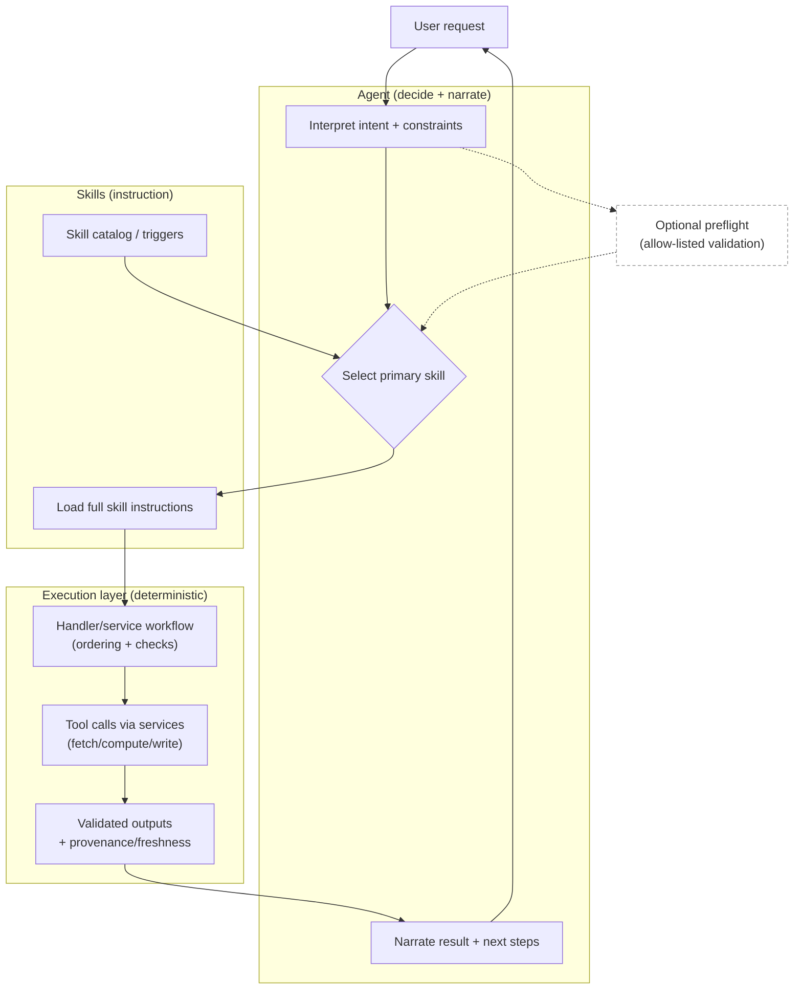

# Unified Agent Founding Principles

## Scope

This document captures a unified approach to building production AI agents, synthesized from building multiple agent systems across different product shapes (e.g., real-time/stateful experiences and request/response analytics workflows).

The goal is to provide **founding principles** you can use to explain and standardize how your company builds AI systems going forward.

---

## TL;DR

- **Prefer one capable agent with modular capabilities** over coordinated specialists unless domains are truly independent.
- **Treat skills as instruction** (how to decide + how to explain) and **tools as execution** (how to compute + how to enforce policy).
- **Use progressive disclosure** to keep context small and relevant; load detailed guidance only when needed.
- **Keep "truth" outside the model**: tools/services compute deterministically; the model narrates from validated summaries.
- **Partition tools by state** when your product has distinct modes (editing vs viewing, setup vs execution).
- **Use multi-agent only when it buys you something real** (distinct identities, parallelism, long-lived side conversations) and keep it bounded with strong contracts.
- **Make time/state explicit** (freshness, pacing, SLAs) and let tools compute it; the agent explains implications and next steps.
- **Treat long-running work as jobs** (job IDs, progress, retries, cancellation).
- **Design tools to fail forward**: errors should include hints, options, and examples so the agent self-corrects quickly.
- **Document for both humans and AI** (AGENTS.md / project rules / checklists). This is a scaling lever, not a nice-to-have.

---

## Key concepts

### Agent (the orchestrator)
An agent is the runtime that:
- understands user intent
- manages state (conversation + application state)
- selects skills (guidance) and calls tools (execution)
- synthesizes tool outputs into user-facing results

### Skill (instruction)
A skill is a reusable, on-demand bundle of **instructional** content:
- workflows, best practices, and constraints
- triggers ("when to use / when not to use")
- examples and common pitfalls

Skills are **not executable**. They teach the agent how to behave.

### Tool (execution)
A tool is a typed, executable interface:
- data access (DB/API/MCP/cache)
- deterministic computation (aggregates, rankings, validations)
- state changes (writes, exports, workflow transitions)

Tools are where you enforce **correctness, policy, and provenance**.

### Handler / service layer (glue)
The glue layer translates "what the skill wants" into "what the tools do":
- handlers orchestrate tool calls in a consistent order
- services contain business logic; tools stay thin wrappers

---

## How the pieces fit together

The shortest way to understand this system is: **the agent decides**, **skills guide**, **tools execute**, and **handlers/services keep execution correct and repeatable**.

- **Skills**: tell the agent *what workflow to follow* and *how to explain results*.
- **Handlers/services**: turn that workflow into a reliable sequence of tool calls (with the right ordering and checks).
- **Tools**: fetch/compute/update deterministically and return validated outputs with provenance.
- **Agent**: narrates from the validated outputs and asks clarifying questions when needed.

### Lifecycle (how a request becomes a correct result)

**Optional optimization (recommended when appropriate):** tool-first preflight for deterministic gating (availability checks, validation) before loading skill instructions. Keep this allow-listed and low-risk.

---

## Why these principles exist

As you deploy AI across more surfaces, you quickly hit the same failure modes:
- agents become hard to reason about as capabilities pile up
- tools drift in contract shape and policy enforcement
- context gets bloated and model quality becomes inconsistent
- "truth" becomes negotiable if the model does too much computation itself

These principles are designed to be portable across domains and products while remaining concrete enough to guide implementation decisions.

---

## Founding principles (with implementation implications)

### 1) Single agent, multiple capabilities

**Principle:** Prefer one orchestrator agent unless you have independent domains (different auth, different users, or different scaling needs).

**Why it works:**
- avoids context loss at handoffs
- reduces "who owns this edge case?" ambiguity
- keeps state coherent (one conversation, one "brain")

### 2) Progressive disclosure (skills as a context scaling mechanism)

**Principle:** Don't preload the universe. Load only what's needed, when it's needed.

**Implications:**
- keep skill metadata concise and discriminative (routing depends on it)
- push detailed workflows into on-demand skill content
- keep reference material separate from the core instructions to avoid bloating Level 2

### 3) Tools are the API, not the implementation

**Principle:** Tools are thin wrappers that validate/auth/route. Business logic lives in services that can be reused outside the agent.

**Why this is foundational:**
- testability: unit test the service layer, not the prompt
- reuse: UI, cron jobs, and agents can call the same domain logic
- safety: authorization and validation live at the boundary

**Design rule:** if your agent "capability" would also be useful from a UI button, it belongs in a service/tool boundary.

### 4) Deterministic computation outside the model ("truth in tools")

**Principle:** If it must be correct, it must be computed deterministically.

**Examples:**
- Analytics: totals, conversion rates, rankings, outliers, and derived metrics should come from tools/services, not LLM arithmetic.
- Stateful domains: state transitions should be idempotent and validated in tools/services.

**Outcome:** the model becomes the explainer/strategist; tools/services become the calculator/auditor.

### 5) State-driven tool partitioning (recommended scaling pattern)

**Principle:** If your product has distinct modes, show the agent different tools per mode.

**Why:**
- tool selection accuracy degrades as tool sets grow and become irrelevant to the current context
- irrelevant tools confuse the agent ("should I edit while viewing?")
- it reduces tokens and guides behavior

**Pattern:** "gateway tools" to enter a state, then unlock a richer tool set inside that state.

**Maturity note:** adopt this once you have both (a) distinct modes and (b) enough tools that irrelevant options start degrading tool selection quality.

### 6) Multi-agent, but bounded (sub-agents as a product feature)

**Principle:** Default to one orchestrator. Introduce additional agents only when you need **distinct identities** (different personas/voices), **parallel work**, or **long-lived side conversations** that are meaningfully separable.

**Recommended structure:**
- **Orchestrator owns truth**: shared state, policy, and final decisions stay centralized.
- **Sub-agents have narrow scope**: limited tool access, limited context, and explicit goals.
- **Explicit lifecycle**: create → activate → suspend/archive (avoid "always on").
- **Resource limits**: cap concurrent sub-agents per session and enforce budgets (cost, latency, tokens).

**Common use cases:**
- role-specific workflows with distinct permissions and context (e.g., analyst vs operator vs admin)
- background "watcher" behaviors (monitoring, summarization, anomaly detection)
- parallel generation (draft variants) when a single tool call isn't enough

### 7) Make time/state explicit (freshness, pacing, SLAs)

**Principle:** In ad tech, "what's true" changes with time. Track that explicitly (freshness, pacing, SLA status) in **structured state** that tools compute; the agent explains what changed and what to do next.

**Recommended primitives:**
- **Freshness/watermarks**: "complete through \(T\)"
- **SLAs/deadlines**: ingestion, delivery windows, backfill cutoffs
- **Pacing**: spend-to-date vs plan, days left, remaining budget
- **Alert tiers**: thresholds → investigate → recommend actions

**Design rules:**
- show **outcomes + next steps**, not internal bookkeeping
- never take irreversible actions without explicit authorization
- convert escalations into **work items** (checks, alerts, suggested queries), not just warnings
- tune update cadence to avoid noise

### 8) Explicit lifecycle for long-running workflows

**Principle:** If work can't reliably finish in one request (exports, big reports, backfills), it's a **job** with an ID, status, progress, and a clear end state.

**Recommended patterns:**
- tools return **job_id** + **status/progress** (don't "hang until done")
- support **cancel** + cleanup (no partial files or orphaned compute)
- make **retries and idempotency** explicit (safe re-run, stable outputs)

### 9) Fail forward (tools should teach the agent how to recover)

**Principle:** Tools must return actionable errors, not generic failures.

**Fail-forward responses include:**
- what was wrong (precise error)
- how to fix (hint)
- what values are valid (options / "did you mean")
- an example corrected call (example payload)
- next step (when relevant)

### 10) Document for AI (and treat it as production infrastructure)

**Principle:** AI-assisted development scales only if you document patterns, pitfalls, and checklists in AI-readable form.

Recommended artifacts:
- `AGENTS.md` (project-specific patterns + ✅/❌ examples + pre-flight checklist)
- a living "architecture + principles" doc (this document is one of those)
- enforcement via code review norms ("cite the pattern you followed")

---

## Anti-patterns (portable across domains)

- **Skills that execute**: skills should not contain real execution logic or pretend to be tools.
- **Tools that teach**: tool descriptions should remain concise; workflows belong in skills.
- **Agents that contain business logic**: the agent orchestrates; services/tools implement.
- **Unbounded tool catalogs**: if the agent sees everything all the time, selection quality degrades.
- **Unbounded context**: progressive disclosure and compaction are not optional at scale.
- **Unbounded agent spawning**: multi-agent without lifecycle/budgets becomes cost and reliability debt.
- **High fan-out delegation**: "one agent per entity" without prioritization creates brittleness and runaway costs.

---

## Checklists (company-wide standards)

### Adding a skill
- Clear triggers ("when to use / when not to use").
- Step-by-step workflow that references tools by name (but does not execute them).
- Common pitfalls and recovery guidance.
- Keep Level 2 scoped; move reference material elsewhere.

### Adding a tool
- Typed contract + stable output shape.
- Enforced authz/scoping + input validation.
- Idempotent where possible; explicit state changes where not.
- Fail-forward errors (hint/options/example).
- Provenance in responses (source, freshness, limitations).
- Business logic in a service layer; tool is a thin wrapper.

---

## Scaling as an organization grows

As adoption grows, the hardest problems become governance and consistency:

- **Ownership**: every skill/tool needs an owner and review norms.
- **Versioning & deprecation**: don't break tool contracts casually; document behavior changes.
- **Observability**: measure skill selection, tool usage, error rates, and latency; use it to prune/merge/refactor.
- **Consistency of truth**: centralize metric definitions and validation; compute deterministically outside the model.

The mature end state is a small set of stable execution tools plus a curated skill library that teaches the agent how to use them well.
